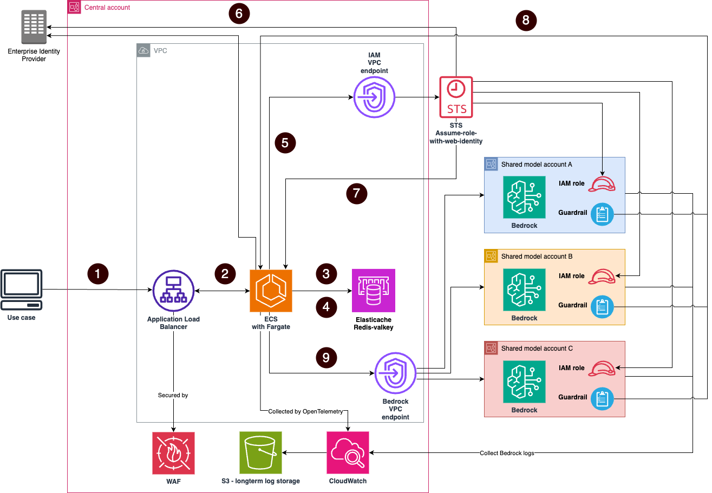

# Enterprise Bedrock Proxy Gateway

An open-source sample implementation of an enterprise gateway for [Amazon Bedrock](https://aws.amazon.com/bedrock/) that demonstrates OAuth 2.0 (Open Authorization 2.0) authentication, rate limiting, multi-account routing, and comprehensive observability patterns.

To understand how this code could be integrated in an enterprise to accelerate GenAI adoption, please review this [blog post](https://aws.amazon.com/blogs/industries/how-to-build-an-enterprise-scale-genai-gateway/).

**Note:** This is a sample implementation provided for educational and demonstration purposes. You should review, test, and customize this code for your specific requirements before deploying to any environment.

## What does this provide?

This sample demonstrates how to build a secure gateway for Amazon Bedrock with:

- **OAuth 2.0 authentication** - Integrate with identity providers like Okta, Auth0, Amazon Cognito, or Microsoft Entra ID
- **Rate limiting** - Token-based quotas per client to control costs
- **Multi-account routing** - Load balance across multiple AWS accounts with automatic failover
- **Credential caching** - Sub-10ms response times with Valkey cache
- **Streaming support** - Real-time model responses
- **Observability** - CloudWatch metrics, X-Ray tracing, and structured logging

## Architecture

The gateway runs on [Amazon ECS](https://aws.amazon.com/ecs/) with [AWS Fargate](https://aws.amazon.com/fargate/) and uses [Application Load Balancer](https://aws.amazon.com/elasticloadbalancing/application-load-balancer/) for traffic distribution.



1. Requests are sent to an Application Load Balancer (ALB) fronted by a WAF in the central account using the Bedrock runtime API. Use cases can use the standard Bedrock API.
2. The ALB routes to an Amazon ECS service implemented in FastAPI that processes the request.
3. The quota of the use case and target accounts is checked in ElastiCache.
4. Check if STS credentials for the use case are cached in ElastiCache to make Bedrock calls in the target accounts by assuming a role with web identity.
5. If credentials are not cached, refresh them by calling the Identity Provider (steps 5–7).
6. Check if the use case has included pre-defined Guardrails in the request and include the ID of the corresponding Guardrail in the target account (see the Guardrails section for details).
7. Forward the Bedrock request with the correct Guardrail ID to one of the target accounts based on available quota.

## Quick start

```bash
# Clone repository
git clone https://github.com/aws-samples/sample-bedrock-proxy-gateway.git
cd sample-bedrock-proxy-gateway

# Configure for your environment
cd infrastructure
cp dev.tfvars dev.local.tfvars
# Edit dev.local.tfvars with your OAuth provider and AWS account details

# Deploy
cd ..
./scripts/deploy.sh dev --apply
```

**Prerequisites:** AWS account, Terraform 1.5+, AWS CLI v2, OAuth 2.0 provider

**Note:** The `.local.*` files (`.local.tfvars`, `.local.tfbackend`, `.local.yaml`) are gitignored for your personal configurations. The base files contain generic examples for the open-source repository.

For detailed instructions, see the [Quick Start Guide](docs/gateway/QUICKSTART.md).

## Documentation

Complete documentation is in the [docs/gateway/](docs/gateway/) directory:

- **[Quick Start](docs/gateway/QUICKSTART.md)** - Deploy in 15 minutes
- **[Setup Guide](docs/gateway/01-setup/)** - Prerequisites, deployment, configuration
- **[Usage Guide](docs/gateway/02-usage/)** - Authentication, API usage, code examples
- **[Architecture](docs/gateway/03-architecture/)** - Components, security, operations
- **[Troubleshooting](docs/gateway/TROUBLESHOOTING.md)** - Common issues and solutions

## Examples

Interactive Jupyter notebooks are available in the [examples/](examples/) directory:

- Getting started and fundamentals
- Embeddings and RAG (Retrieval-Augmented Generation)
- Image generation and guardrails
- Rate limiting and operations

## Resources

- [Documentation](docs/gateway/)
- [Amazon Bedrock User Guide](https://docs.aws.amazon.com/bedrock/latest/userguide/)
- [Amazon Bedrock API Reference](https://docs.aws.amazon.com/bedrock/latest/APIReference/)
- [OAuth 2.0 Specification](https://oauth.net/2/)

## Security

See [CONTRIBUTING](CONTRIBUTING.md#security-issue-notifications) for more information.

## License

This library is licensed under the Apache 2.0 License. See the LICENSE file.

## Authors

The following authors have contributed this sample within AWS and prepared it for open-source release:
- [Yuvaraj Kesavan](https://github.com/YuvarajKesavan)
- [Rumeshkrishnan Mohan](https://github.com/rumeshkrish)
- [Nicola D'Orazio](https://github.com/Njk00)
- [Konstantin Zerebcov](https://github.com/kzerebcov)
- [David Sauerwein](https://github.com/Antropath)

Special thanks to [Olivier Brique](https://github.com/obriqaws) for his thorough review and suggestions that helped improve the solution.


