# Deployment

Deploy the gateway infrastructure and make your first request.

This guide walks you through deploying the gateway to AWS, verifying the deployment, and making your first request to Amazon Bedrock.

## Before you begin

Complete the [Prerequisites](01-prerequisites.md) checklist.

## Step 1: Set up Terraform backend

The gateway uses Terraform to manage infrastructure. First, create the backend resources to store Terraform state.

Run the setup script:

```bash
./scripts/setup.sh dev
```

This script creates:

- [Amazon Simple Storage Service (Amazon S3)](https://aws.amazon.com/s3/) bucket for Terraform state
- [Amazon DynamoDB](https://aws.amazon.com/dynamodb/) table for state locking
- Backend configuration files in `infrastructure/backend/`

The script automatically uses your AWS account ID and region to create uniquely named resources.

## Step 2: Configure Terraform variables

Create a Terraform variables file for your environment.

**Copy the example configuration:**

```bash
cd infrastructure
cp dev.tfvars dev.local.tfvars
```

**Edit `dev.local.tfvars` with your values:**

```hcl
# Environment
environment = "dev"

# OAuth Configuration (required)
oauth_jwks_url = "https://<your-provider>/.well-known/jwks.json"
oauth_issuer = "https://<your-provider>/"
jwt_audience = "your-audience"
jwt_allowed_scopes = "your-scopes"

# AWS Accounts (comma-separated for multi-account load balancing)
shared_account_ids = "123456789012"  # Or "123456789012,234567890123,345678901234"
central_account_id = "234567890123"
```

**Note:** `.local.tfvars` files are gitignored. The base `dev.tfvars` file contains generic examples for the repository.

### OAuth configuration

You must configure an OAuth 2.0 provider. The gateway supports any provider that implements the client credentials flow.

**Example for Auth0:**

```hcl
oauth_jwks_url = "https://<tenant>.us.auth0.com/.well-known/jwks.json"
oauth_issuer = "https://<tenant>.us.auth0.com/"
jwt_audience = "bedrockproxygateway"
jwt_allowed_scopes = "bedrockproxygateway:invoke"
```

For detailed OAuth setup instructions, refer to [OAuth Configuration](03-oauth.md).

### Multi-account configuration

Add the AWS account IDs where you have Amazon Bedrock access:

```hcl
shared_account_ids = "123456789012,234567890123"
```

The gateway automatically creates IAM roles in these accounts and distributes requests across them for higher quotas.

## Step 3: Configure rate limits

Edit the rate limit configuration file for your environment:

```bash
vim backend/app/core/rate_limit/config/base.yaml
```

Add your configuration:

```yaml
permissions:
  clients:
    default:
      quota:
        requests_per_minute: 100
        tokens_per_minute: 50000
      accounts:
        - "123456789012"

account_limits:
  "123456789012":
    us-east-1:
      anthropic.claude-3-5-sonnet-20241022-v2:0:
        input_tokens_per_minute: 400000
        output_tokens_per_minute: 80000
```

The `default` client applies to all requests unless you configure specific client IDs. For more information about rate limiting configuration, refer to [Rate Limiting](04-rate-limiting.md).

## Step 4: Deploy infrastructure

Deploy the gateway using the deployment script:

```bash
./scripts/deploy.sh dev --apply
```

The deployment takes approximately 15-20 minutes and creates:

- [Amazon Virtual Private Cloud (Amazon VPC)](https://aws.amazon.com/vpc/) with public and private subnets across 2 Availability Zones
- Application Load Balancer (ALB) with HTTPS listener
- [Amazon Elastic Container Service (Amazon ECS)](https://aws.amazon.com/ecs/) cluster with Fargate tasks
- [Amazon ElastiCache](https://aws.amazon.com/elasticache/) for Valkey cluster (for rate limiting)
- IAM roles and policies
- VPC endpoints for AWS services
- [Amazon CloudWatch](https://aws.amazon.com/cloudwatch/) log groups

### Architecture deployed

```mermaid
graph TB
    subgraph "Central Account"
        ALB[Application Load Balancer]
        ECS[ECS on Fargate]
        Cache[ElastiCache Valkey]
    end

    subgraph "Shared Accounts"
        BR1[Bedrock Account 1]
        BR2[Bedrock Account 2]
    end

    Client[Client Apps] -->|HTTPS + JWT| ALB
    ALB --> ECS
    ECS <--> Cache
    ECS -->|AssumeRole| BR1
    ECS -->|AssumeRole| BR2

    style ALB fill:#ff9900
    style ECS fill:#ff9900
    style Cache fill:#ff9900
    style BR1 fill:#232f3e
    style BR2 fill:#232f3e
```



### Deployment outputs

After deployment completes, Terraform displays important outputs:

```
alb_dns_name = "bedrock-gateway-dev-123456789.us-east-1.elb.amazonaws.com"
ecs_cluster_name = "bedrock-gateway-dev"
valkey_endpoint = "bedrock-gateway-dev.abc123.serverless.use1.cache.amazonaws.com:6379"
```

Save the `alb_dns_name` value—you'll use it to make requests.

## Step 5: Verify deployment

### Check health endpoint

Test the gateway health endpoint:

```bash
ALB_DNS="<your-alb-dns-name>"
curl https://$ALB_DNS/health
```

Expected response:

```json
{
  "status": "healthy",
  "version": "1.0.0"
}
```

If the health check fails, refer to [TROUBLESHOOTING.md](../TROUBLESHOOTING.md#health-check-failures).

### Check ECS tasks

Verify ECS tasks are running:

```bash
aws ecs describe-services \
  --cluster bedrock-gateway-dev \
  --services bedrock-gateway-service \
  --query 'services[0].runningCount'
```

You should see at least 1 running task.

### View logs

Check application logs:

```bash
aws logs tail /aws/ecs/bedrock-gateway-dev --follow
```

You should see startup logs indicating the application is ready.

## Step 6: Get OAuth credentials

Get OAuth credentials from your identity provider. The exact steps depend on your provider.

**For Auth0:**

1. Log in to your Auth0 dashboard
2. Navigate to **Applications** → **APIs**
3. Choose your API
4. Go to **Test** tab
5. Copy the `client_id` and `client_secret`

**For other providers:**

Refer to your provider's documentation for creating OAuth client credentials.

### Store credentials (optional)

You can store credentials in [AWS Secrets Manager](https://aws.amazon.com/secrets-manager/) for secure access:

```bash
aws secretsmanager create-secret \
  --name bedrock-gateway-dev-oauth-credentials \
  --secret-string '{
    "client_id": "<CLIENT_ID>",
    "client_secret": "<CLIENT_SECRET>",
    "token_url": "<TOKEN_URL>",
    "audience": "bedrockproxygateway"
  }' \
  --region us-east-1
```

## Step 7: Make your first request

### Get an access token

Request an OAuth access token using the client credentials flow:

```bash
TOKEN=$(curl -s -X POST <token_url> \
  -H "Content-Type: application/x-www-form-urlencoded" \
  -d "grant_type=client_credentials" \
  -d "client_id=<client_id>" \
  -d "client_secret=<client_secret>" \
  -d "audience=<audience>" \
  | jq -r '.access_token')
```

Replace `<token_url>`, `<client_id>`, `<client_secret>`, and `<audience>` with your OAuth provider values.

Verify the token was retrieved:

```bash
echo $TOKEN
```

### Invoke a model

Make your first request to Amazon Bedrock through the gateway:

```bash
curl -X POST https://$ALB_DNS/model/anthropic.claude-3-5-sonnet-20241022-v2:0/converse \
  -H "Authorization: Bearer $TOKEN" \
  -H "Content-Type: application/json" \
  -d '{
    "messages": [
      {
        "role": "user",
        "content": [{"text": "Hello! Can you help me test this gateway?"}]
      }
    ]
  }'
```

Expected response:

```json
{
  "output": {
    "message": {
      "role": "assistant",
      "content": [
        {
          "text": "Hello! I'd be happy to help you test the gateway..."
        }
      ]
    }
  },
  "usage": {
    "inputTokens": 18,
    "outputTokens": 45,
    "totalTokens": 63
  },
  "stopReason": "end_turn"
}
```

### Try streaming

Test streaming responses:

```bash
curl -N -X POST https://$ALB_DNS/model/anthropic.claude-3-5-sonnet-20241022-v2:0/converse-stream \
  -H "Authorization: Bearer $TOKEN" \
  -H "Content-Type: application/json" \
  -d '{
    "messages": [
      {
        "role": "user",
        "content": [{"text": "Count to 5"}]
      }
    ]
  }'
```

You'll see the response stream in real-time as server-sent events.

### Check rate limit headers

The gateway includes rate limit information in response headers:

```bash
curl -i -X POST https://$ALB_DNS/model/anthropic.claude-3-5-sonnet-20241022-v2:0/converse \
  -H "Authorization: Bearer $TOKEN" \
  -H "Content-Type: application/json" \
  -d '{
    "messages": [
      {"role": "user", "content": [{"text": "Hi"}]}
    ]
  }'
```

Look for these headers:

```
X-RateLimit-Limit: 100
X-RateLimit-Remaining: 99
X-RateLimit-Reset: 1737408000
```

## Update deployment

### Update infrastructure

To update infrastructure configuration:

1. Edit `infrastructure/dev.tfvars`
2. Run the deployment script again:

```bash
./scripts/deploy.sh dev --apply
```

Terraform applies only the changes needed.

### Update application code

To deploy application code changes:

1. Build and push a new container image:

```bash
# Authenticate with Amazon ECR
aws ecr get-login-password --region us-east-1 | \
  docker login --username AWS --password-stdin <account-id>.dkr.ecr.us-east-1.amazonaws.com

# Build and push
cd backend
docker build -t bedrock-gateway:latest .
docker tag bedrock-gateway:latest <account-id>.dkr.ecr.us-east-1.amazonaws.com/bedrock-gateway:latest
docker push <account-id>.dkr.ecr.us-east-1.amazonaws.com/bedrock-gateway:latest
```

1. Force ECS to deploy the new image:

```bash
aws ecs update-service \
  --cluster bedrock-gateway-dev \
  --service bedrock-gateway-service \
  --force-new-deployment
```

### Update rate limits

To update rate limit configuration:

1. Edit `backend/app/core/rate_limit/config/base.yaml`
2. Rebuild and push the container image (see above)
3. Force ECS deployment

The gateway loads rate limit configuration at startup, so you need to restart tasks for changes to take effect.

## Cleanup

When you're done testing or want to remove the gateway, you can delete all resources.

### Remove all infrastructure

Use the destroy script:

```bash
./scripts/destroy.sh dev
```

With custom AWS profiles:

```bash
./scripts/destroy.sh dev --central-profile personal --shared-profiles personal
```

The cleanup takes approximately 10-15 minutes.

### Remove backend resources (optional)

To remove the Terraform state bucket and DynamoDB table:

```bash
ACCOUNT_ID=$(aws sts get-caller-identity --query Account --output text)
aws s3 rb s3://bedrock-proxy-gateway-terraform-state-${ACCOUNT_ID}-us-east-1 --force
aws dynamodb delete-table --table-name bedrock-proxy-gateway-terraform-locks
```

## Troubleshooting

### Deployment fails

If Terraform fails, check the error message and verify:

- AWS credentials are valid
- You have required IAM permissions
- No resource name conflicts exist
- Backend is initialized

For detailed troubleshooting, refer to [TROUBLESHOOTING.md](../TROUBLESHOOTING.md#deployment-issues).

### ECS tasks not starting

Check ECS task logs:

```bash
aws logs tail /aws/ecs/bedrock-gateway-dev --follow
```

Common causes:

- Container image pull failures
- Invalid environment variables
- Insufficient IAM permissions

### Authentication fails

Verify your OAuth token:

```bash
echo $TOKEN | cut -d. -f2 | base64 -d | jq
```

Check that:

- Token has not expired
- Issuer matches `OAUTH_ISSUER` environment variable
- Audience matches `JWT_AUDIENCE` environment variable
- Required scopes are present

For more troubleshooting help, refer to [TROUBLESHOOTING.md](../TROUBLESHOOTING.md).

## Next steps

Now that you have the gateway deployed:

- Configure additional features in [OAuth Configuration](03-oauth.md)
- Set up rate limiting in [Rate Limiting](04-rate-limiting.md)
- Add more AWS accounts in [Multi-Account](05-multi-account.md)
- Learn about making requests in [Making Requests](../02-usage/02-making-requests.md)
- Explore code examples in [Code Examples](../02-usage/03-code-examples.md)
