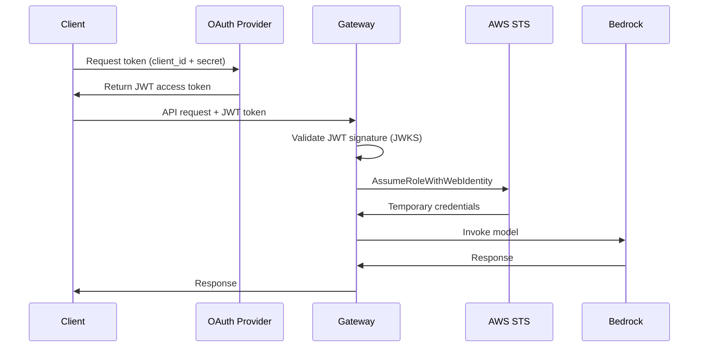

# OAuth configuration

Configure OAuth 2.0 authentication to secure access to the gateway.

The gateway uses OAuth 2.0 with JSON Web Tokens (JWT) to authenticate clients. You can use any OAuth provider that supports the client credentials flow.

## How OAuth works with the gateway

The gateway uses the OAuth 2.0 client credentials flow for machine-to-machine authentication:



The flow:

1. Your application requests an access token from your OAuth provider using client credentials
2. The OAuth provider validates credentials and returns a JWT access token
3. Your application includes the token in the Authorization header when calling the gateway
4. The gateway validates the token signature using the provider's JWKS endpoint
5. The gateway uses the validated token to assume an IAM role via AWS STS
6. The gateway forwards your request to Amazon Bedrock

## OAuth provider requirements

Your OAuth provider must support:

- **Client credentials flow** - For machine-to-machine authentication
- **JWT tokens** - With standard claims (iss, aud, exp)
- **JWKS endpoint** - For token signature verification
- **Custom scopes** - To control access levels

The gateway works with any OAuth 2.0 compliant provider, including:

- Auth0
- Okta
- Azure Active Directory
- Keycloak
- Any RFC 6749 compliant provider

## Option 1: Use your existing OAuth provider

If your organization already has an OAuth provider, you can integrate it with the gateway.

### Get your provider configuration

You need these values from your OAuth provider:

- **JWKS URL** - Usually at `https://your-provider/.well-known/jwks.json`
- **Issuer URL** - The OAuth provider's base URL
- **Audience** - The identifier for your API
- **Scopes** - Custom scopes for access control

### Configure the gateway

Add these values to your Terraform variables file (`infrastructure/dev.local.tfvars`):

```hcl
oauth_jwks_url     = "https://your-provider/.well-known/jwks.json"
oauth_issuer       = "https://your-provider/"
jwt_audience       = "your-api-identifier"
jwt_allowed_scopes = "bedrock:read,bedrock:invoke"
```

### Test your configuration

Get a token from your provider and test it:

```bash
# Get token (format varies by provider)
TOKEN=$(curl -s -X POST <your-token-url> \
  -H "Content-Type: application/x-www-form-urlencoded" \
  -d "grant_type=client_credentials" \
  -d "client_id=<your-client-id>" \
  -d "client_secret=<your-client-secret>" \
  | jq -r '.access_token')

# Test with gateway
curl -H "Authorization: Bearer $TOKEN" \
  https://<gateway-url>/health
```

## Option 2: Set up Auth0 for testing

If you don't have an OAuth provider, you can use Auth0's free tier for testing.

### Create Auth0 account

To create an Auth0 account:

1. Go to [auth0.com](https://auth0.com) and sign up
2. Create a new tenant (for example, `your-tenant-name`)
3. Note your tenant domain (for example, `your-tenant-name.us.auth0.com`)

### Create an API

To create an API in Auth0:

1. In the Auth0 dashboard, choose **Applications** → **APIs**
2. Choose **Create API**
3. Enter the following:
   - **Name**: Bedrock Gateway API
   - **Identifier**: bedrockproxygateway
   - **Signing Algorithm**: RS256
4. Choose **Create**

### Add permissions

To add custom scopes:

1. In your API, choose the **Permissions** tab
2. Add these permissions:
   - `bedrockproxygateway:invoke` - Invoke Bedrock models
   - `bedrockproxygateway:read` - Read-only access
   - `bedrockproxygateway:admin` - Administrative access
3. Choose **Save**

### Create a machine-to-machine application

To create a client application:

1. Choose **Applications** → **Applications**
2. Choose **Create Application**
3. Enter a name (for example, `Test Client`)
4. Choose **Machine to Machine Applications**
5. Choose **Create**
6. Select your API (Bedrock Gateway API)
7. Grant the permissions you created
8. Choose **Authorize**

### Get your credentials

From the application settings:

1. Copy the **Client ID**
2. Copy the **Client Secret**
3. Note the **Domain** (for example, `your-tenant-name.us.auth0.com`)

Your configuration values:

```
JWKS URL: https://<tenant>.us.auth0.com/.well-known/jwks.json
Issuer: https://<tenant>.us.auth0.com/
Audience: bedrockproxygateway
Token URL: https://<tenant>.us.auth0.com/oauth/token
Scopes: bedrockproxygateway:invoke,bedrockproxygateway:read,bedrockproxygateway:admin
```

### Test token generation

Test that you can get a token:

```bash
curl -X POST https://<tenant>.us.auth0.com/oauth/token \
  -H "Content-Type: application/x-www-form-urlencoded" \
  -d "grant_type=client_credentials" \
  -d "client_id=<CLIENT_ID>" \
  -d "client_secret=<CLIENT_SECRET>" \
  -d "audience=bedrockproxygateway"
```

Expected response:

```json
{
  "access_token": "eyJ...",
  "token_type": "Bearer",
  "expires_in": 86400
}
```

### Verify token format

Decode the token to verify it has the required claims:

```bash
# Save token to variable
TOKEN="<your-token>"

# Decode payload (second part of JWT)
echo $TOKEN | cut -d'.' -f2 | base64 -d | jq
```

Required claims:

```json
{
  "iss": "https://<tenant>.us.auth0.com/",
  "aud": "bedrockproxygateway",
  "exp": 1234567890,
  "client_id": "<CLIENT_ID>",
  "scope": "bedrockproxygateway:invoke"
}
```

## Configure the gateway

Add your OAuth configuration to Terraform variables (`infrastructure/dev.local.tfvars`):

```hcl
oauth_jwks_url     = "https://<tenant>.us.auth0.com/.well-known/jwks.json"
oauth_issuer       = "https://<tenant>.us.auth0.com/"
jwt_audience       = "bedrockproxygateway"
jwt_allowed_scopes = "bedrockproxygateway:invoke,bedrockproxygateway:read,bedrockproxygateway:admin"
```

Deploy or update your infrastructure:

```bash
./scripts/deploy.sh dev --apply
```

## Store credentials securely

Store OAuth credentials in [AWS Secrets Manager](https://aws.amazon.com/secrets-manager/):

```bash
aws secretsmanager create-secret \
  --name bedrock-gateway-dev-oauth-credentials \
  --secret-string '{
    "client_id": "<CLIENT_ID>",
    "client_secret": "<CLIENT_SECRET>",
    "token_url": "https://<tenant>.us.auth0.com/oauth/token",
    "audience": "bedrockproxygateway"
  }' \
  --region us-east-1
```

This makes credentials available to your applications without hardcoding them.

## Add more clients

To add additional client applications:

### In Auth0

1. Choose **Applications** → **Applications**
2. Choose **Create Application**
3. Choose **Machine to Machine Applications**
4. Select your API
5. Grant required permissions
6. Save the new Client ID and Client Secret

### In the gateway

No changes needed. All clients use the same audience value, so the gateway configuration doesn't change. You can optionally configure per-client rate limits in the YAML configuration.

## Verify authentication

After deploying the gateway, test authentication:

```bash
# Get token
TOKEN=$(curl -s -X POST https://<tenant>.us.auth0.com/oauth/token \
  -H "Content-Type: application/x-www-form-urlencoded" \
  -d "grant_type=client_credentials" \
  -d "client_id=<CLIENT_ID>" \
  -d "client_secret=<CLIENT_SECRET>" \
  -d "audience=bedrockproxygateway" \
  | jq -r '.access_token')

# Test health endpoint
curl -H "Authorization: Bearer $TOKEN" \
  https://<gateway-url>/health

# Test Bedrock request
curl -X POST https://<gateway-url>/model/anthropic.claude-3-5-sonnet-20241022-v2:0/converse \
  -H "Authorization: Bearer $TOKEN" \
  -H "Content-Type: application/json" \
  -d '{
    "messages": [
      {"role": "user", "content": [{"text": "Hello"}]}
    ]
  }'
```

## Troubleshooting

### Token validation fails

**Symptom:** 401 Unauthorized responses

**Check:**

- Verify `oauth_issuer` matches the `iss` claim in your token
- Verify `jwt_audience` matches the `aud` claim in your token
- Verify `oauth_jwks_url` is accessible from the gateway
- Check that token has not expired

For detailed troubleshooting, refer to [TROUBLESHOOTING.md](../TROUBLESHOOTING.md#authentication-issues).

### Cannot get token

**Symptom:** OAuth provider returns error

**Check:**

- Verify client_id and client_secret are correct
- Verify client is authorized for your API
- Verify you're using the correct token URL
- Check that client credentials flow is enabled

### AssumeRoleWithWebIdentity fails

**Symptom:** Gateway logs show STS errors

**Check:**

- Verify OAuth issuer URL matches exactly (including trailing slash)
- Verify audience value is in the IAM role trust policy
- Check that the OIDC provider exists in AWS IAM

For more help, refer to [TROUBLESHOOTING.md](../TROUBLESHOOTING.md).

## Next steps

After configuring OAuth:

- Set up rate limiting in [Rate Limiting](04-rate-limiting.md)
- Configure multiple AWS accounts in [Multi-Account](05-multi-account.md)
- Learn about making requests in [Making Requests](../02-usage/02-making-requests.md)
