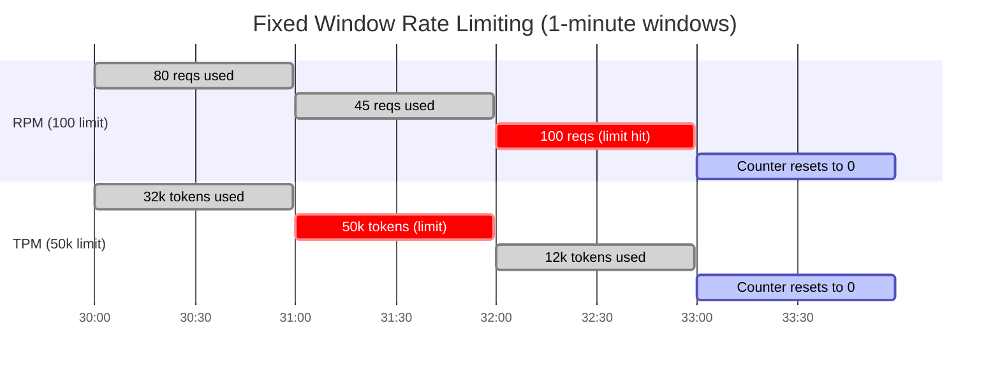

# Rate limiting

Configure request and token quotas to control costs and prevent quota exhaustion.

The gateway implements dual-level rate limiting to protect both your clients and your AWS accounts from exceeding Amazon Bedrock quotas.

## How rate limiting works

The gateway enforces rate limits at two levels:

1. **Client quotas** - Limits per client across all AWS accounts
2. **Account limits** - Capacity limits per AWS account

```mermaid
graph LR
    A[Request] --> B{Check Client Quota}
    B -->|Within Limit| C{Check Account Capacity}
    B -->|Exceeded| D[429 Rate Limit]
    C -->|Available| E[Forward to Bedrock]
    C -->|Exhausted| F[Try Next Account]
    F --> C

    style A fill:#ff9900
    style B fill:#232f3e
    style C fill:#232f3e
    style D fill:#ff9900
    style E fill:#ff9900
    style F fill:#232f3e
```



### Client quotas

Client quotas limit how much a single client can use across all AWS accounts. This prevents one client from consuming all available capacity.

Example: Client A has a quota of 100 requests per minute. Even if you have 10 AWS accounts, Client A can only make 100 requests per minute total.

### Account limits

Account limits represent the actual capacity of each AWS account. This prevents the gateway from exceeding Amazon Bedrock quotas and getting throttled.

Example: Account 1 has a limit of 400,000 input tokens per minute for Claude 3.5 Sonnet. The gateway won't send more than this to avoid throttling.

## Configuration files

Rate limits are configured in YAML files. The gateway loads the file based on your environment:

- `backend/app/core/rate_limit/config/base.yaml` - Base configuration
- `backend/app/core/rate_limit/config/dev.yaml` - Development environment
- `backend/app/core/rate_limit/config/test.yaml` - Test environment

**For personal configurations**, copy to `.local.yaml` files:

```bash
cd backend/app/core/rate_limit/config
cp base.yaml base.local.yaml
# Edit base.local.yaml with your actual account IDs and client IDs
```

**Note:** `.local.yaml` files are gitignored and take precedence over base files.

The `ENVIRONMENT` environment variable determines which file to load.

## Basic configuration

Here's a minimal configuration:

```yaml
permissions:
  clients:
    default:
      quota:
        requests_per_minute: 100
        tokens_per_minute: 50000
      accounts:
        - "123456789012"

account_limits:
  "123456789012":
    us-east-1:
      anthropic.claude-3-5-sonnet-20241022-v2:0:
        input_tokens_per_minute: 400000
        output_tokens_per_minute: 80000
```

This configuration:

- Allows all clients 100 requests and 50,000 tokens per minute
- Routes requests to AWS account `123456789012`
- Limits the account to 400,000 input tokens and 80,000 output tokens per minute

## Client quotas

### Default client

The `default` client applies to all clients that don't have specific configuration:

```yaml
permissions:
  clients:
    default:
      quota:
        requests_per_minute: 100
        tokens_per_minute: 50000
      accounts:
        - "123456789012"
```

### Specific clients

You can configure quotas for specific clients using their client ID from the JWT token:

```yaml
permissions:
  clients:
    default:
      quota:
        requests_per_minute: 100
        tokens_per_minute: 50000
      accounts:
        - "123456789012"

    high-priority-client:
      quota:
        requests_per_minute: 500
        tokens_per_minute: 250000
      accounts:
        - "123456789012"
        - "234567890123"
```

The client ID comes from the JWT token's `client_id`, `sub`, or `azp` claim (checked in that order).

### Unlimited quotas

Set quotas to `-1` for unlimited access:

```yaml
permissions:
  clients:
    admin-client:
      quota:
        requests_per_minute: -1
        tokens_per_minute: -1
      accounts:
        - "123456789012"
```

Use this carefully—unlimited quotas can still hit AWS account limits.

## Account limits

Account limits represent the actual Amazon Bedrock quotas for each AWS account and model.

### Per-model limits

Configure limits for each model in each account:

```yaml
account_limits:
  "123456789012":
    us-east-1:
      anthropic.claude-3-5-sonnet-20241022-v2:0:
        input_tokens_per_minute: 400000
        output_tokens_per_minute: 80000

      anthropic.claude-3-haiku-20240307-v1:0:
        input_tokens_per_minute: 400000
        output_tokens_per_minute: 80000
```

### Multiple accounts

Configure limits for each account:

```yaml
account_limits:
  "123456789012":
    us-east-1:
      anthropic.claude-3-5-sonnet-20241022-v2:0:
        input_tokens_per_minute: 400000
        output_tokens_per_minute: 80000

  "234567890123":
    us-east-1:
      anthropic.claude-3-5-sonnet-20241022-v2:0:
        input_tokens_per_minute: 400000
        output_tokens_per_minute: 80000
```

The gateway distributes requests across accounts based on available capacity.

### Cross-region inference

For cross-region inference models, use the region prefix:

```yaml
account_limits:
  "123456789012":
    us-east-1:
      us.anthropic.claude-3-5-sonnet-20241022-v2:0:
        input_tokens_per_minute: 400000
        output_tokens_per_minute: 80000
```

## Complete example

Here's a complete configuration example:

```yaml
permissions:
  clients:
    # Default for all clients
    default:
      quota:
        requests_per_minute: 50
        tokens_per_minute: 25000
      accounts:
        - "123456789012"

    # High-priority client
    priority-app-client:
      quota:
        requests_per_minute: 500
        tokens_per_minute: 250000
      accounts:
        - "123456789012"
        - "234567890123"

    # Development client
    dev-client:
      quota:
        requests_per_minute: 100
        tokens_per_minute: 50000
      accounts:
        - "456789012345"

    # Admin client (unlimited)
    admin-client:
      quota:
        requests_per_minute: -1
        tokens_per_minute: -1
      accounts:
        - "123456789012"
        - "234567890123"

account_limits:
  # Production account 1
  "123456789012":
    us-east-1:
      anthropic.claude-3-5-sonnet-20241022-v2:0:
        input_tokens_per_minute: 400000
        output_tokens_per_minute: 80000
      anthropic.claude-3-haiku-20240307-v1:0:
        input_tokens_per_minute: 400000
        output_tokens_per_minute: 80000

  # Production account 2
  "234567890123":
    us-east-1:
      anthropic.claude-3-5-sonnet-20241022-v2:0:
        input_tokens_per_minute: 400000
        output_tokens_per_minute: 80000

  # Development account
  "456789012345":
    us-east-1:
      anthropic.claude-3-5-sonnet-20241022-v2:0:
        input_tokens_per_minute: 200000
        output_tokens_per_minute: 40000
```

## How quota enforcement works

### Fixed window strategy

The gateway uses a **fixed window** algorithm. Time is divided into 1-minute buckets aligned to clock boundaries:



Both RPM and TPM use the same fixed window mechanism with separate counters. A request is rejected if **either** limit is exceeded.

At the start of each minute, all counters reset to zero. Each request increments the counter for the current window. If the counter exceeds the configured limit, the request is rejected with a 429 error.

**Why fixed window?** It provides O(1) performance and predictable memory usage in Valkey — each rate limit key is a single integer with a 60-second TTL.

**Known limitation:** Because counters reset at minute boundaries, a client could theoretically consume up to 2x their limit across a window boundary (for example, 100 requests at 10:30:59 and 100 more at 10:31:00). Amazon Bedrock's own quotas provide a secondary safeguard against this.

**No burst capacity:** Client quotas are hard limits. If a client exhausts their quota, requests are rejected even if overall account capacity is available from unused quotas of other clients. This is by design — the purpose of rate limiting is to prevent noisy neighbors from monopolizing shared Bedrock capacity. To give a client more capacity, increase their quota in the YAML configuration.

### Atomic multi-limit check

The gateway checks all four limits in a single atomic Lua script execution in Valkey:

1. Client RPM (requests per minute)
2. Client TPM (tokens per minute)
3. Account RPM
4. Account TPM

Counters are only incremented if **all** checks pass. This prevents partial consumption where a request passes the RPM check but fails the TPM check.

### Request-level limiting

The gateway checks request quotas before sending to Amazon Bedrock:

1. Extract client ID from JWT token
2. Check client's requests per minute quota
3. If exceeded, return 429 error
4. If within limit, proceed to token check

### Token-level limiting

The gateway estimates and tracks token usage:

1. Estimate input tokens from request content
2. Check client's tokens per minute quota
3. Reserve estimated tokens
4. Send request to Amazon Bedrock
5. Update with actual token count from response

Token estimation uses the same algorithm as Amazon Bedrock for accuracy.

### Account selection

When a client has multiple accounts, the gateway selects the account with the most available capacity:

1. Filter accounts assigned to the client
2. Check each account's available token quota
3. Select account with highest available capacity
4. If no accounts have capacity, return 429 error

## Rate limit headers

The gateway includes rate limit information in response headers:

```bash
curl -i https://gateway/model/claude-3-sonnet/converse \
  -H "Authorization: Bearer $TOKEN" \
  -d '{"messages": [...]}'
```

Response headers:

```
X-RateLimit-Limit: 100
X-RateLimit-Remaining: 87
X-RateLimit-Reset: 1737408060
```

- `X-RateLimit-Limit` - Total quota for the time window
- `X-RateLimit-Remaining` - Remaining quota
- `X-RateLimit-Reset` - Unix timestamp when quota resets

## Validate configuration

Before deploying, validate your configuration:

```bash
cd backend
python -m app.core.rate_limit.usecase_quota_checker
```

This checks:

- YAML syntax is valid
- All required fields are present
- Client quotas don't exceed account limits
- Account IDs are valid format
- Model IDs are valid format

## Update configuration

To update rate limits:

1. Edit the YAML file for your environment
2. Rebuild the container image
3. Deploy the new image to ECS

```bash
# Edit configuration
vim backend/app/core/rate_limit/config/dev.yaml

# Rebuild and push image
cd backend
docker build -t bedrock-proxy-gateway:latest .
docker push <ecr-repo>/bedrock-proxy-gateway:latest

# Force ECS deployment
aws ecs update-service \
  --cluster bedrock-proxy-gateway-dev \
  --service bedrock-proxy-gateway-service \
  --force-new-deployment
```

The gateway loads configuration at startup, so you need to restart tasks for changes to take effect.

## Monitor rate limits

### CloudWatch metrics

The gateway publishes rate limiting metrics to CloudWatch:

- `RateLimitHits` - Number of requests rejected due to rate limits
- `QuotaUtilization` - Percentage of quota used
- `AccountCapacity` - Available capacity per account

### Check quota usage

View current quota usage in logs:

```bash
aws logs tail /aws/ecs/bedrock-proxy-gateway-dev --follow --filter-pattern "quota"
```

### Set up alarms

Create CloudWatch alarms for high quota utilization:

```bash
aws cloudwatch put-metric-alarm \
  --alarm-name bedrock-proxy-gateway-high-rate-limit-hits \
  --metric-name RateLimitHits \
  --namespace BedrockGateway \
  --statistic Sum \
  --period 300 \
  --evaluation-periods 2 \
  --threshold 100 \
  --comparison-operator GreaterThanThreshold
```

## Troubleshooting

### Rate limit exceeded errors

**Symptom:** Clients receive 429 errors

```json
{
  "__type": "ThrottlingException",
  "message": "Rate limit exceeded"
}
```

**Solutions:**

- Increase client quota in YAML configuration
- Add more AWS accounts to distribute load
- Implement exponential backoff in client applications
- Check if quota utilization is consistently high

### Configuration not loading

**Symptom:** Rate limits not being enforced

**Check:**

- Verify `RATE_LIMITING_ENABLED=true` in environment variables
- Check ECS task logs for configuration errors
- Verify YAML file exists in container image
- Validate YAML syntax

### Quota not resetting

**Symptom:** Quota remains at zero

Rate limits reset every minute. Wait 60 seconds and retry. If the issue persists, check Valkey connectivity.

For more troubleshooting help, refer to [TROUBLESHOOTING.md](../TROUBLESHOOTING.md#rate-limiting-issues).

## Next steps

After configuring rate limiting:

- Set up multiple AWS accounts in [Multi-Account](05-multi-account.md)
- Learn about environment variables in [Environment Variables](06-environment-variables.md)
- Monitor your deployment in [Operations](../03-architecture/04-operations.md)
