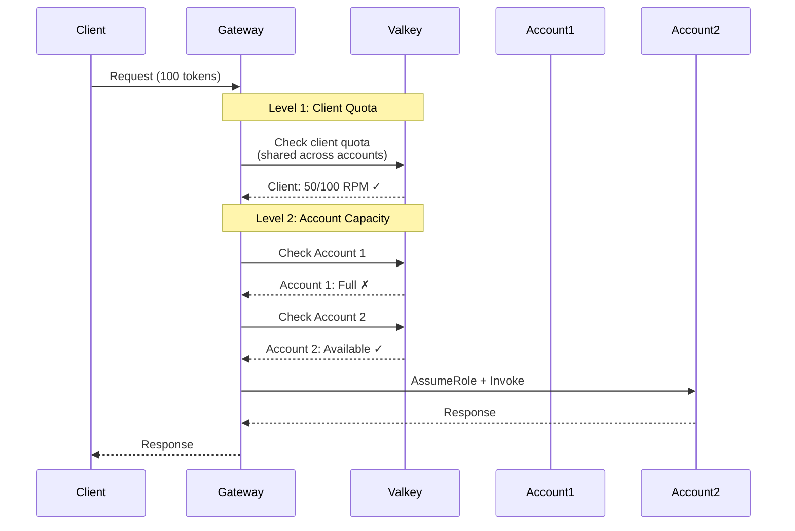

# Multi-account configuration

Configure multiple AWS accounts to increase capacity, isolate costs, and improve availability.

The gateway can distribute requests across multiple AWS accounts, each with its own Amazon Bedrock quotas. This increases your total capacity and provides cost isolation.

## Why use multiple accounts

### Increase capacity

Amazon Bedrock enforces per-account quotas for each model. By using multiple accounts, you multiply your total capacity.

Example: If one account has a quota of 400,000 tokens per minute for Claude 3.5 Sonnet, three accounts give you 1,200,000 tokens per minute total.

### Isolate costs

Each AWS account gets its own bill. You can use separate accounts for:

- Different teams or departments
- Different projects or applications
- Different environments (dev, test)

This makes cost tracking and chargeback straightforward.

### Improve availability

If one account hits its quota or experiences issues, the gateway automatically routes requests to other accounts. This provides built-in failover.

### Regional deployment

You can deploy accounts in different regions to reduce latency for global users while keeping the gateway centralized.

## How it works

The gateway uses a dual-level quota system:



**Level 1: Client quota** - Limits how much a client can use across all accounts

**Level 2: Account capacity** - Tracks each account's available quota

The gateway automatically selects the account with the most available capacity.

## Configure multiple accounts

### Step 1: Add account IDs to Terraform

Edit your Terraform variables file:

```hcl
# infrastructure/dev.local.tfvars
shared_account_ids = "123456789012,234567890123,456789012345"
```

You can add as many accounts as you need (comma-separated). The gateway creates IAM roles in each account automatically.

### Step 2: Enable Bedrock in each account

For each shared account:

1. Log in to the AWS account
2. Go to the Amazon Bedrock console
3. Choose **Model access** in the navigation pane
4. Request access to the models you want to use

Verify access:

```bash
aws bedrock list-foundation-models --region us-east-1 --profile <account-profile>
```

### Step 3: Configure rate limits

Edit your rate limit configuration to include all accounts:

```yaml
# backend/app/core/rate_limit/config/base.yaml
permissions:
  clients:
    default:
      quota:
        requests_per_minute: 300
        tokens_per_minute: 150000
      accounts:
        - "123456789012"
        - "234567890123"
        - "456789012345"

account_limits:
  "123456789012":
    us-east-1:
      anthropic.claude-3-5-sonnet-20241022-v2:0:
        input_tokens_per_minute: 400000
        output_tokens_per_minute: 80000

  "234567890123":
    us-east-1:
      anthropic.claude-3-5-sonnet-20241022-v2:0:
        input_tokens_per_minute: 400000
        output_tokens_per_minute: 80000

  "456789012345":
    us-east-1:
      anthropic.claude-3-5-sonnet-20241022-v2:0:
        input_tokens_per_minute: 400000
        output_tokens_per_minute: 80000
```

This configuration:

- Allows clients 300 requests per minute total across all accounts
- Distributes requests across three accounts
- Each account can handle 400,000 input tokens per minute

### Step 4: Deploy

Deploy the updated configuration:

```bash
./scripts/deploy.sh dev --apply
```

Terraform creates IAM roles in each shared account with the necessary trust relationships.

## Account selection

The gateway selects accounts automatically based on available capacity:

1. **Filter eligible accounts** - Check which accounts the client is allowed to use
2. **Check capacity** - Query available quota for each account
3. **Select best account** - Choose the account with the most available capacity
4. **Assume role** - Get temporary credentials for the selected account
5. **Invoke model** - Forward the request to Amazon Bedrock

If all accounts are at capacity, the gateway returns a 429 rate limit error.

## Assign accounts to clients

You can assign different accounts to different clients:

```yaml
permissions:
  clients:
    default:
      quota:
        requests_per_minute: 100
        tokens_per_minute: 50000
      accounts:
        - "123456789012"  # Shared account

    premium-client:
      quota:
        requests_per_minute: 500
        tokens_per_minute: 250000
      accounts:
        - "234567890123"  # Dedicated account
        - "456789012345"  # Dedicated account
```

This gives premium clients access to dedicated accounts with higher total capacity.

## IAM roles

The gateway uses IAM roles to access Amazon Bedrock in each shared account.

### How it works

1. Terraform creates an IAM role in each shared account
2. The role trusts the OAuth provider (web identity federation)
3. The gateway uses the client's JWT token to assume the role
4. AWS STS returns temporary credentials
5. The gateway uses the credentials to call Amazon Bedrock

### Trust relationship

The IAM role in each shared account has this trust policy:

```json
{
  "Version": "2012-10-17",
  "Statement": [
    {
      "Effect": "Allow",
      "Principal": {
        "Federated": "arn:aws:iam::<shared-account-id>:oidc-provider/<oauth-issuer>"
      },
      "Action": "sts:AssumeRoleWithWebIdentity",
      "Condition": {
        "StringEquals": {
          "<oauth-issuer>:aud": "bedrockproxygateway"
        }
      }
    }
  ]
}
```

Terraform creates this automatically—you don't need to configure it manually.

### Permissions

The IAM role has permissions to invoke Amazon Bedrock:

```json
{
  "Version": "2012-10-17",
  "Statement": [
    {
      "Effect": "Allow",
      "Action": [
        "bedrock:InvokeModel",
        "bedrock:InvokeModelWithResponseStream"
      ],
      "Resource": "*"
    }
  ]
}
```

## Monitor account usage

### Check which account was used

The gateway logs which account handled each request:

```bash
aws logs tail /aws/ecs/bedrock-proxy-gateway-dev --follow --filter-pattern "account_id"
```

### View account distribution

Check CloudWatch metrics to see request distribution across accounts:

```bash
aws cloudwatch get-metric-statistics \
  --namespace BedrockGateway \
  --metric-name RequestsByAccount \
  --dimensions Name=AccountId,Value=123456789012 \
  --start-time $(date -u -d '1 hour ago' +%Y-%m-%dT%H:%M:%S) \
  --end-time $(date -u +%Y-%m-%dT%H:%M:%S) \
  --period 300 \
  --statistics Sum
```

### Monitor quota utilization

Track how much of each account's quota is being used:

```bash
aws logs tail /aws/ecs/bedrock-proxy-gateway-dev --follow --filter-pattern "quota_utilization"
```

## Test multi-account routing

Make multiple requests and verify they're distributed across accounts:

```bash
# Make 10 requests
for i in {1..10}; do
  curl -X POST https://<gateway-url>/model/anthropic.claude-3-5-sonnet-20241022-v2:0/converse \
    -H "Authorization: Bearer $TOKEN" \
    -H "Content-Type: application/json" \
    -d '{
      "messages": [
        {"role": "user", "content": [{"text": "Request '$i'"}]}
      ]
    }'
done

# Check logs to see which accounts were used
aws logs tail /aws/ecs/bedrock-proxy-gateway-dev --follow --filter-pattern "account_id"
```

You should see requests distributed across your configured accounts.

## Troubleshooting

### All accounts return 429 errors

**Symptom:** Requests fail even though you have multiple accounts

**Causes:**

- All accounts are at their quota limits
- Account limits in YAML don't match actual Bedrock quotas
- Client quota is too low

**Solutions:**

- Increase account limits in YAML configuration
- Request quota increases from AWS Support
- Add more accounts
- Increase client quotas

### Requests only use one account

**Symptom:** All requests go to the same account

**Causes:**

- Only one account configured in client's account list
- Other accounts not configured in account_limits
- Other accounts have zero capacity configured

**Solutions:**

- Verify client has multiple accounts in YAML configuration
- Check account_limits includes all accounts
- Verify account limits are greater than zero

### AssumeRole fails

**Symptom:** Gateway logs show STS errors

**Causes:**

- IAM role doesn't exist in shared account
- Trust relationship not configured correctly
- OAuth issuer doesn't match

**Solutions:**

- Run Terraform to create IAM roles
- Verify OAuth issuer URL matches exactly (including trailing slash)
- Check IAM role trust policy includes correct OIDC provider

For more troubleshooting help, refer to [TROUBLESHOOTING.md](../TROUBLESHOOTING.md#multi-account-issues).

## Next steps

After configuring multiple accounts:

- Review environment variables in [Environment Variables](06-environment-variables.md)
- Set up advanced features in [Advanced Configuration](07-advanced.md)
- Monitor your deployment in [Operations](../03-architecture/04-operations.md)
