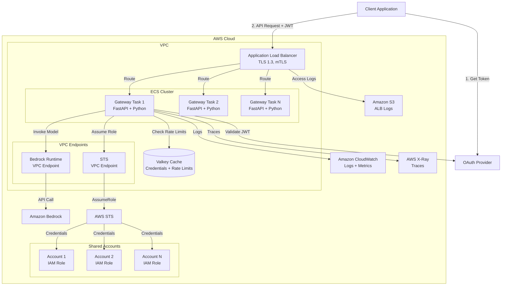

# Overview

System components and design decisions.

## Architecture diagram

## System components

### Application Load Balancer

Distributes traffic across ECS tasks and handles TLS termination.

**Features:**

- HTTPS listener on port 443 with TLS 1.3
- Optional mTLS for client certificate validation
- Health checks to `/health` endpoint
- 4000-second idle timeout for long requests
- Access logs to Amazon S3

**Deployment modes:**

- **Public ALB** - Accessible from internet with HTTPS
- **Internal ALB** - Accessible only from VPC

### ECS Fargate

Runs gateway containers with serverless compute.

**Configuration:**

- Fargate launch type (no EC2 management)
- Rolling deployment strategy
- Circuit breaker with automatic rollback
- Container Insights for monitoring

**Auto-scaling:**

- Scales based on CPU, memory, and request rate
- Min: 1-2 tasks, Max: 40 tasks
- Target: 75% CPU, 90% memory utilization

### Gateway application

Python FastAPI application that processes requests.

**Technology:**

- Python 3.13 with FastAPI
- Uvicorn ASGI server
- Boto3 for AWS SDK
- OpenTelemetry for observability

**Key features:**

- JWT validation with JWKS
- Rate limiting with Lua scripts
- Multi-account credential management
- Credential caching (1-hour TTL)
- Streaming support

### Valkey (Redis)

Stores rate limiting state and provides fast key-value access.

**Configuration:**

- Serverless mode (automatic scaling)
- In-transit encryption with TLS
- At-rest encryption with AWS KMS
- Deployed in private subnets

**Usage:**

- Rate limit counters (requests per minute, tokens per minute)
- Atomic operations with Lua scripts
- Sub-millisecond latency

### VPC and networking

Dedicated VPC with public and private subnets.

**VPC:**

- CIDR: 10.0.0.0/16 (65,536 IPs)
- DNS hostnames and resolution enabled
- Flow logs to CloudWatch

**Subnets:**

- Public subnets (10.0.10.0/24, 10.0.11.0/24) - ALB, NAT Gateway
- Private subnets (10.0.1.0/24, 10.0.2.0/24) - ECS tasks, Valkey
- Deployed across 2 Availability Zones

**VPC endpoints:**

- Amazon Bedrock Runtime
- AWS STS
- Amazon ECR (API and Docker)
- Amazon S3
- CloudWatch Logs
- AWS Secrets Manager
- Amazon DynamoDB
- AWS Systems Manager
- AWS KMS
- Amazon ECS
- Amazon ECS Telemetry

### IAM roles

**ECS task role:**

- Assumes roles in shared accounts
- Invokes Amazon Bedrock models
- Reads from Secrets Manager

**ECS execution role:**

- Pulls container images from ECR
- Writes logs to CloudWatch
- Reads secrets for environment variables

**Shared account roles:**

- Trust relationship with OAuth provider (web identity federation)
- Bedrock invoke permissions
- VPC endpoint condition for security

## Credential caching

The gateway caches STS credentials to reduce latency.

**How it works:**

1. First request: Gateway assumes IAM role (1-2 seconds)
2. Credentials cached in memory with 1-hour TTL
3. Subsequent requests: Use cached credentials (sub-10ms)
4. Expiration: Gateway automatically refreshes credentials

**Benefits:**

- Sub-10ms credential retrieval
- Reduced STS API costs
- Improved reliability
- Automatic expiration handling

**Cache key:** `{account_id}:{region}:{model_id}`

## Design decisions

### Why Fargate?

- No server management
- Automatic scaling
- Pay only for what you use
- Built-in security isolation

### Why Valkey?

- Sub-millisecond latency for rate limiting
- Atomic operations with Lua scripts
- Serverless mode (automatic scaling)
- Redis-compatible (mature ecosystem)

### Why VPC endpoints?

- Keep traffic within AWS network
- Reduce NAT Gateway costs
- Improve security posture
- Enable VPC endpoint conditions in IAM policies

### Why multi-account?

- Increase total Amazon Bedrock quotas
- Isolate costs per team or project
- Provide automatic failover
- Support regional deployment

### Why credential caching?

- Reduce latency from 1-2s to sub-10ms
- Reduce STS API costs
- Improve reliability (fewer API calls)
- Better user experience

## Observability

### CloudWatch Logs

All application logs go to CloudWatch:

- Structured JSON format
- Request/response logging
- Error tracking
- Performance metrics

### CloudWatch Metrics

Custom metrics published:

- Request count
- Request latency
- Rate limit hits
- Token usage
- Account distribution

### AWS X-Ray

Distributed tracing for requests:

- End-to-end request flow
- Service dependencies
- Performance bottlenecks
- Error analysis

### OpenTelemetry

Standardized observability:

- Traces, metrics, and logs
- Collector sidecar in ECS
- Export to CloudWatch and X-Ray
- Vendor-neutral instrumentation

## Scalability

### Horizontal scaling

ECS tasks scale based on:

- CPU utilization (target: 75%)
- Memory utilization (target: 90%)
- Request rate
- ALB queue depth

### Vertical scaling

Adjust task resources:

- CPU: 256-4096 units (0.25-4 vCPU)
- Memory: 512-30720 MB (0.5-30 GB)

### Multi-account scaling

Add AWS accounts to increase capacity:

- Each account has independent quotas
- Gateway distributes load automatically
- Linear scaling with account count

## High availability

### Multi-AZ deployment

- ALB spans 2 Availability Zones
- ECS tasks distributed across AZs
- Valkey deployed in multiple AZs
- Automatic failover on AZ failure

### Health checks

- ALB health checks every 30 seconds
- Unhealthy tasks automatically replaced
- Circuit breaker prevents bad deployments

### Automatic recovery

- ECS restarts failed tasks
- ALB routes around unhealthy tasks
- Multi-account failover for quota exhaustion

## Security

### Network isolation

- Private subnets for compute
- Security groups restrict traffic
- VPC endpoints for AWS services
- No direct internet access from tasks

### Authentication and authorization

**OAuth 2.0 with JWT validation:**

- Client credentials flow for machine-to-machine authentication
- JWKS-based signature validation
- Token expiration, issuer, audience, and scope validation
- Optional mTLS for client certificate authentication

**IAM roles and web identity federation:**

- ECS task role assumes roles in shared accounts
- Shared account roles trust OAuth provider via web identity federation
- Temporary credentials only (1-hour TTL)
- Credentials cached securely in memory

### Encryption

**Data in transit:**

- TLS 1.3 for all external connections
- ALB handles TLS termination
- VPC endpoints use TLS for AWS services
- Valkey connections encrypted with TLS

**Data at rest:**

- Valkey encrypted with AWS KMS
- CloudWatch Logs encrypted with KMS
- S3 buckets encrypted with KMS
- EBS volumes encrypted

### Application security

**Rate limiting:**

- Per-client request and token limits
- Per-account capacity limits
- Atomic operations in Valkey prevent race conditions

**Input validation:**

- JWT token format validation
- Request body structure validation
- Model ID and parameter validation

**Logging and audit:**

- All requests logged to CloudWatch
- JWT claims logged (tokens not stored)
- Rate limit decisions logged
- CloudTrail for AWS API calls

## Next steps

- Learn about request processing in [Request Flow](02-request-flow.md)
- Understand networking in [Networking](03-networking.md)
- Set up monitoring in [Operations](04-operations.md)
