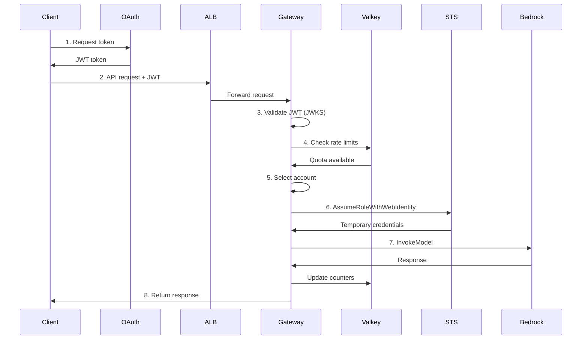
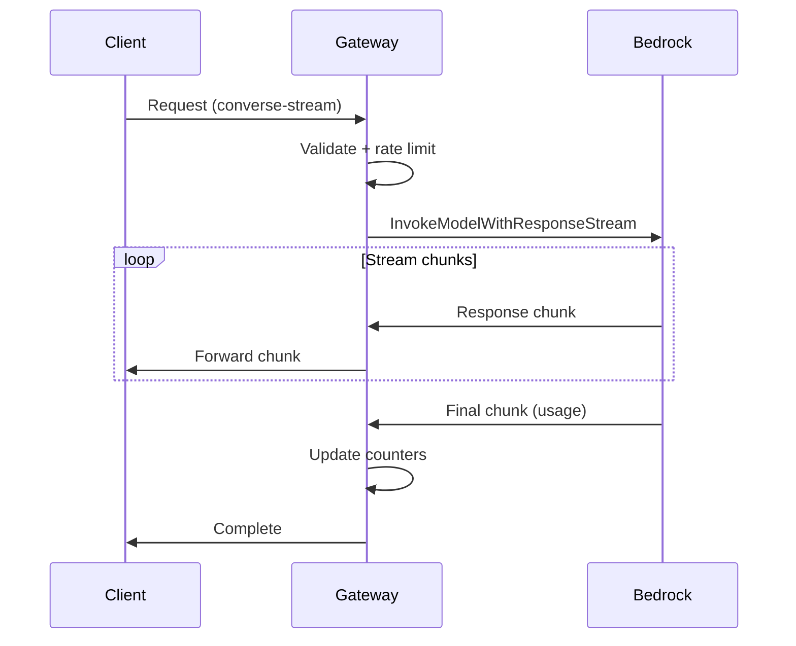
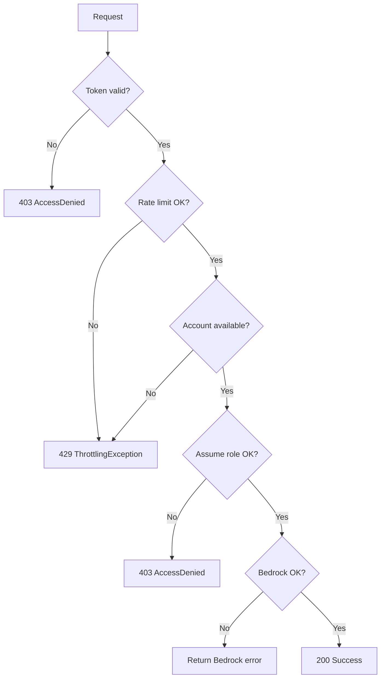

# Request flow

How requests are processed through the gateway.

## Request flow overview



## Step-by-step flow

### 1. Client authentication

Client requests OAuth token from identity provider:

```bash
curl -X POST https://oauth-provider/oauth/token \
  -d "grant_type=client_credentials" \
  -d "client_id=xxx" \
  -d "client_secret=yyy"
```

OAuth provider validates credentials and returns JWT token.

### 2. Request routing

Client sends request to ALB with JWT token:

```bash
curl -X POST https://gateway/model/claude-3-sonnet/converse \
  -H "Authorization: Bearer <token>" \
  -d '{"messages": [...]}'
```

ALB forwards request to healthy ECS task.

### 3. Token validation

Gateway validates JWT token:

1. Extract token from Authorization header
2. Fetch public keys from OAuth provider's JWKS endpoint
3. Verify token signature
4. Check token expiration
5. Validate issuer and audience claims
6. Verify required scopes

If validation fails, return 403 error.

### 4. Rate limit check

Gateway checks rate limits in Valkey:

1. Extract client ID from JWT token
2. Check client's requests per minute quota
3. Check client's tokens per minute quota
4. Estimate input tokens from request
5. Reserve tokens in Valkey

If quota exceeded, return 429 error.

### 5. Account selection

Gateway selects AWS account:

1. Get list of accounts assigned to client
2. Check each account's available capacity in Valkey
3. Select account with most available capacity
4. If no accounts available, return 429 error

### 6. Credential acquisition

Gateway assumes IAM role in selected account:

1. Check credential cache for valid credentials
2. If cached, use existing credentials (sub-10ms)
3. If not cached, call STS AssumeRoleWithWebIdentity
4. Cache credentials with 1-hour TTL
5. Return temporary credentials

### 7. Bedrock invocation

Gateway invokes Amazon Bedrock:

1. Create Bedrock client with temporary credentials
2. Forward request to Bedrock API
3. Stream or buffer response
4. Extract actual token usage from response

### 8. Response and cleanup

Gateway returns response to client:

1. Update Valkey with actual token usage
2. Add rate limit headers to response
3. Log request details to CloudWatch
4. Send trace to X-Ray
5. Return response to client

## Streaming flow

For streaming requests, the flow is similar but response handling differs:



The gateway streams responses without buffering, providing real-time output.

## Error handling flow

When errors occur, the gateway handles them appropriately:



## Caching behavior

### Credential cache

- **Key:** `{account_id}:{region}:{model_id}`
- **TTL:** 1 hour (matches STS credential lifetime)
- **Storage:** In-memory (per ECS task)
- **Benefit:** Reduces latency from 1-2s to sub-10ms

### JWKS cache

- **Key:** OAuth provider JWKS URL
- **TTL:** 1 hour
- **Storage:** In-memory (per ECS task)
- **Benefit:** Reduces OAuth provider load

## Performance characteristics

**First request (cold start):**

- JWT validation: 50-100ms
- Rate limit check: 1-5ms
- STS AssumeRole: 1000-2000ms
- Bedrock invocation: 500-5000ms (model dependent)
- **Total:** 1.5-7 seconds

**Subsequent requests (warm):**

- JWT validation: 1-5ms (JWKS cached)
- Rate limit check: 1-5ms
- Credential retrieval: <1ms (cached)
- Bedrock invocation: 500-5000ms (model dependent)
- **Total:** 0.5-5 seconds

## Next steps

- Understand networking in [Networking](03-networking.md)
- Review security implementation in [Overview](01-overview.md#security)
- Monitor performance in [Operations](04-operations.md)
