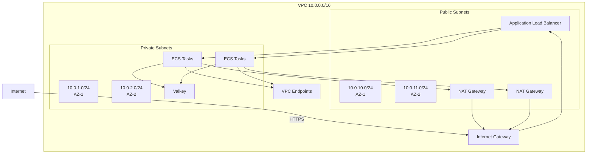

# Networking

VPC architecture and network configuration.

## VPC architecture

The gateway deploys in a dedicated VPC with public and private subnets across multiple Availability Zones.



## Subnets

### Public subnets

**Purpose:** Resources that need direct internet access

**CIDR blocks:**

- AZ-1: 10.0.10.0/24 (256 IPs)
- AZ-2: 10.0.11.0/24 (256 IPs)

**Resources:**

- Application Load Balancer
- NAT Gateways
- Internet Gateway attachment

**Route table:**

- 0.0.0.0/0 → Internet Gateway
- 10.0.0.0/16 → Local

### Private subnets

**Purpose:** Resources that should not have direct internet access

**CIDR blocks:**

- AZ-1: 10.0.1.0/24 (256 IPs)
- AZ-2: 10.0.2.0/24 (256 IPs)

**Resources:**

- ECS Fargate tasks
- Valkey cluster
- VPC endpoint network interfaces

**Route table:**

- 0.0.0.0/0 → NAT Gateway (for outbound)
- 10.0.0.0/16 → Local

## VPC endpoints

VPC endpoints keep traffic within the AWS network and enable VPC endpoint conditions in IAM policies.

### Interface endpoints

**Amazon Bedrock Runtime:**

- Service: `com.amazonaws.us-east-1.bedrock-runtime`
- Used for: Model invocations
- Private DNS: Enabled

**AWS STS:**

- Service: `com.amazonaws.us-east-1.sts`
- Used for: AssumeRoleWithWebIdentity
- Private DNS: Enabled

**Amazon ECR API:**

- Service: `com.amazonaws.us-east-1.ecr.api`
- Used for: Container image metadata
- Private DNS: Enabled

**Amazon ECR Docker:**

- Service: `com.amazonaws.us-east-1.ecr.dkr`
- Used for: Container image layers
- Private DNS: Enabled

**CloudWatch Logs:**

- Service: `com.amazonaws.us-east-1.logs`
- Used for: Application logs
- Private DNS: Enabled

**AWS Secrets Manager:**

- Service: `com.amazonaws.us-east-1.secretsmanager`
- Used for: Retrieving secrets
- Private DNS: Enabled

**AWS Systems Manager:**

- Service: `com.amazonaws.us-east-1.ssm`
- Used for: ECS Exec
- Private DNS: Enabled

**AWS KMS:**

- Service: `com.amazonaws.us-east-1.kms`
- Used for: Encryption keys
- Private DNS: Enabled

**Amazon ECS:**

- Service: `com.amazonaws.us-east-1.ecs`
- Used for: ECS API calls
- Private DNS: Enabled

### Gateway endpoints

**Amazon S3:**

- Service: `com.amazonaws.us-east-1.s3`
- Used for: ALB logs, mTLS certificates
- Type: Gateway endpoint (no ENI)

**Amazon DynamoDB:**

- Service: `com.amazonaws.us-east-1.dynamodb`
- Used for: Terraform state locking
- Type: Gateway endpoint (no ENI)

## Security groups

### ALB security group

**Inbound rules:**

- Port 443 (HTTPS) from 0.0.0.0/0 (public ALB)
- Port 443 (HTTPS) from VPC CIDR (internal ALB)

**Outbound rules:**

- Port 8000 to ECS security group

### ECS security group

**Inbound rules:**

- Port 8000 from ALB security group

**Outbound rules:**

- Port 443 to VPC endpoint security group
- Port 6379 to Valkey security group
- Port 443 to 0.0.0.0/0 (for OAuth provider via NAT)

### Valkey security group

**Inbound rules:**

- Port 6379 from ECS security group

**Outbound rules:**

- None (no outbound traffic needed)

### VPC endpoint security group

**Inbound rules:**

- Port 443 from ECS security group

**Outbound rules:**

- None (no outbound traffic needed)

## Network flow

### Inbound request flow

1. Client → Internet → Internet Gateway
2. Internet Gateway → ALB (public subnet)
3. ALB → ECS task (private subnet)
4. ECS task → VPC endpoint (private subnet)
5. VPC endpoint → AWS service

### Outbound flow (OAuth validation)

1. ECS task → NAT Gateway (public subnet)
2. NAT Gateway → Internet Gateway
3. Internet Gateway → OAuth provider

### Internal flow (rate limiting)

1. ECS task → Valkey (private subnet)
2. All traffic stays within VPC

## DNS resolution

**VPC DNS settings:**

- DNS resolution: Enabled
- DNS hostnames: Enabled

**Private DNS for VPC endpoints:**

- Enabled for all interface endpoints
- Allows using standard AWS service endpoints
- Traffic automatically routes through VPC endpoints

**Example:**

```python
# Uses VPC endpoint automatically
bedrock = boto3.client('bedrock-runtime', region_name='us-east-1')
```

## Network performance

**Latency:**

- ALB → ECS: <1ms (same AZ)
- ECS → Valkey: <1ms (same AZ)
- ECS → VPC endpoint: 1-5ms
- ECS → OAuth provider: 50-200ms (via NAT)

**Bandwidth:**

- ALB: Up to 100 Gbps
- ECS task: Up to 10 Gbps
- VPC endpoint: Up to 10 Gbps per ENI

## Cost optimization

### Use VPC endpoints

VPC endpoints eliminate NAT Gateway data transfer costs for AWS services:

- Bedrock API calls: $0.01/GB via NAT → $0.00 via VPC endpoint
- STS API calls: $0.01/GB via NAT → $0.00 via VPC endpoint

### Right-size NAT Gateways

NAT Gateways are only needed for OAuth provider access:

- Low traffic: Single NAT Gateway
- High availability: NAT Gateway per AZ
- Cost: $0.045/hour + $0.045/GB processed

## Troubleshooting

### Cannot reach OAuth provider

**Check:**

- NAT Gateway exists in public subnet
- Route table has 0.0.0.0/0 → NAT Gateway
- Security group allows outbound port 443
- Network ACLs allow traffic

### Cannot reach AWS services

**Check:**

- VPC endpoints exist
- VPC endpoint security group allows port 443
- Private DNS enabled for VPC endpoints
- Route table has correct routes

### High latency

**Check:**

- Resources in same AZ when possible
- VPC endpoints in same AZ as ECS tasks
- Network ACLs not blocking traffic

For more help, refer to [TROUBLESHOOTING.md](../TROUBLESHOOTING.md#network-issues).

## Next steps

- Review security implementation in [Overview](01-overview.md#security)
- Monitor network metrics in [Operations](04-operations.md)
- Configure advanced networking in [Advanced Configuration](../01-setup/07-advanced.md)
