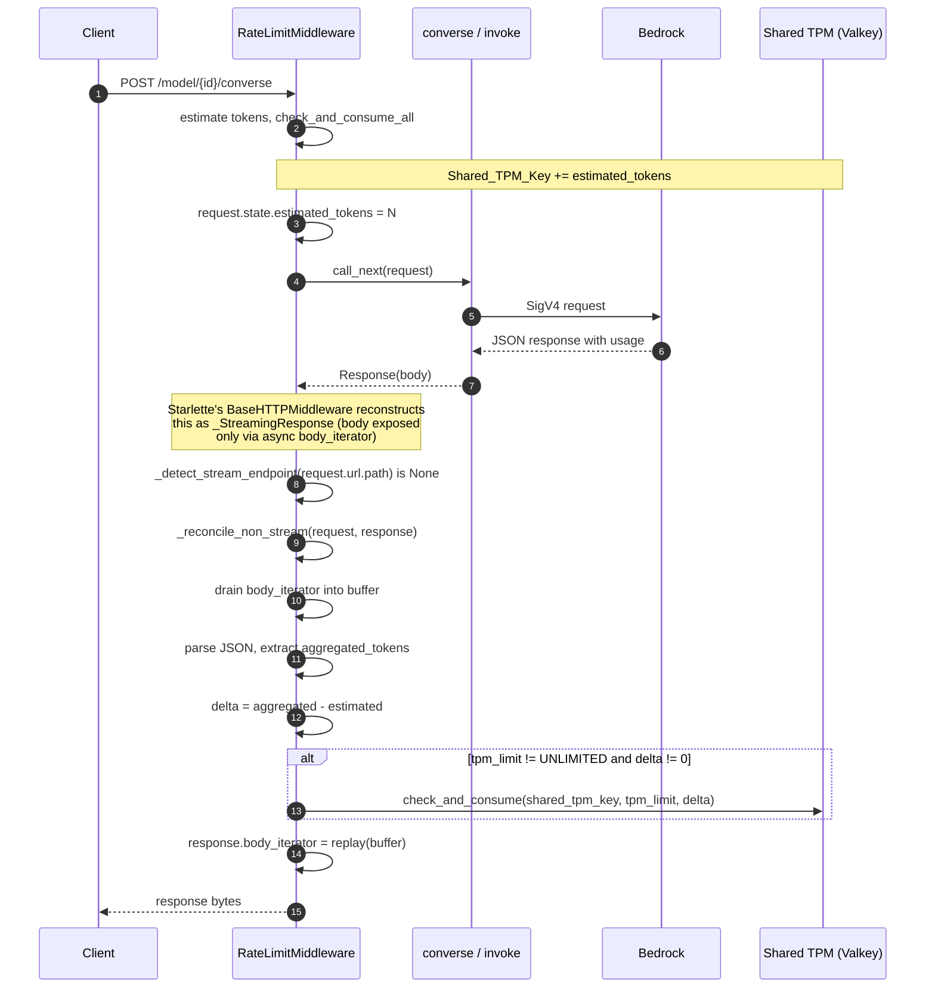

# Rate limiting for synchronous (non-streaming) responses

Post-response TPM reconciliation for `/model/{id}/converse` and `/model/{id}/invoke`.

## Overview

The rate-limit middleware charges TPM in two phases for every non-streaming Bedrock request:

1. Pre-request: estimate input tokens, atomically consume against the shared TPM counter, forward the request to Bedrock.
2. Post-response: read the actual `usage` block from Bedrock's JSON response, compute the aggregated total (input + output * burndown + cache-write), and add the delta to the shared TPM counter.

Phase 2 runs after `call_next` returns the response object. Under `BaseHTTPMiddleware` (the parent class of `RateLimitMiddleware`), that object is a `starlette.responses._StreamingResponse` regardless of what the downstream route produced. This is Starlette's design, not our code: downstream ASGI apps do not return Response objects, they emit `http.response.body` messages into a `send` callable. To hand middleware authors a Response-shaped object, `BaseHTTPMiddleware` reconstructs one from those messages and exposes the body as an async iterator over them. Whether the downstream route returned a `JSONResponse` in one message or a `StreamingResponse` in a hundred, the wrapper looks the same. The class name reflects the transport shape (a stream of ASGI messages), not the semantic intent of the route.

The reconciler drains that iterator into a byte buffer, parses the JSON, applies the signed delta to Shared_TPM_Key, and reassigns `body_iterator` to a single-shot replay of the same bytes so Starlette can still forward the response to the client.

## Sequence



## Module layout

| Path | Role |
| --- | --- |
| `backend/app/middleware/rate_limit.py::_reconcile_non_stream` | Drains and replays `body_iterator`, applies the signed reconciliation delta. |
| `backend/app/middleware/rate_limit.py::_update_tokens` | Routes by URL. Streaming paths go to `_reconcile_stream`; everything else goes to `_reconcile_non_stream`. |
| `backend/app/middleware/rate_limit.py::_detect_stream_endpoint` | Shared URL classifier introduced by the streaming feature. |
| `backend/app/core/rate_limit/tokens.py::TokenCounter.extract` | Existing helper. Reads the `usage` block and applies the burndown-rate multiplier. Reused here verbatim. |
| `backend/app/core/rate_limit/limiter.py::RateLimiter.check_and_consume` | Existing signed-`INCRBY` helper against the FixedWindow bucket. Reused here verbatim. |

## How it works

### URL-based routing

`_update_tokens` calls `_detect_stream_endpoint(request.url.path)` to decide which reconciler to invoke:

- `/converse-stream` or `/invoke-with-response-stream` -> `_reconcile_stream`.
- Any other path with `rate_ctx` on `request.state` -> `_reconcile_non_stream`.

Type-based detection would not work here. As explained in the [Overview](#overview), `BaseHTTPMiddleware` reconstructs every downstream response, streaming and non-streaming alike, as `starlette.responses._StreamingResponse`. That class inherits from `Response`, not from `StreamingResponse`, and exposes its body only through `body_iterator`. An `isinstance(response, StreamingResponse)` check returns `False` for every response the middleware sees. The URL is the only reliable signal for which reconciliation path to take.

### Draining and replaying `body_iterator`

The reconciler drains the wrapped iterator into a local `bytes` buffer:

```python
chunks: list[bytes] = []
async for chunk in response.body_iterator:
 chunks.append(bytes(chunk))
body_bytes = b"".join(chunks)
```

Then reassigns `body_iterator` to a single-shot async generator that yields the same bytes:

```python
async def _replay_body() -> AsyncIterator[bytes]:
 yield body_bytes

response.body_iterator = _replay_body()
```

Starlette iterates `body_iterator` exactly once during response serialization, so a single-shot generator is sufficient. Content-Length and Content-Type headers are untouched.

Buffering is safe for non-streaming responses because the payload is bounded by the model's response size (typically a few KB, at most a few MB for very long completions). It is not safe for streaming responses (an unbounded chunk sequence), which is why the streaming path uses the wrap-and-observe reconciler instead.

### Signed delta semantics

```python
aggregated_tokens = self.tokens.extract(response_data, api_type, model_id)
estimated_tokens = getattr(request.state, "estimated_tokens", 0)
delta = aggregated_tokens - estimated_tokens
```

`delta` is intentionally not clamped. When Bedrock's actual usage falls below the pre-request estimate (short completion, cache-hit, over-conservative estimator), the delta is negative and refunds the client's quota via `INCRBY <negative>`. When usage exceeds the estimate, the delta is positive and closes the accounting gap. The final counter always equals `aggregated_tokens`.

### Error isolation

Three layers, matching the streaming reconciler:

Outer `try / except` in `_update_tokens` catches every exception, logs Redis-family failures as `redis_failure_token_update`, and swallows the rest. No exception propagates to the client response.

Redis-write guard inside `_reconcile_non_stream` wraps the `check_and_consume` call in its own `try / except`. On failure the reconciler records `record_redis_failure("token_update", <ExceptionType>)`, logs `redis_failure_token_update`, and returns without raising. The buffered body has already been reassigned to `body_iterator` at this point, so the client still gets the response.

JSON-decode guard short-circuits gracefully on malformed bodies (error responses, non-model endpoints slipping past the URL filter). Emits a `rate_limit_reconciled_skipped` event with `reason=non_json_body` and returns without touching the counter.

### The `rate_ctx_absent` short-circuit

If `request.state.rate_ctx` is not set (public paths, disabled middleware, guardrail bypass), the reconciler returns immediately. No body drain, no reassignment. Any body the response carries reaches the client unchanged.

## Observability

Structured log events emitted by `_reconcile_non_stream`:

| `event.name` | When | Required fields |
| --- | --- | --- |
| `rate_limit_reconciled` | Successful reconciliation, one per non-streaming request | `gen_ai.request.model`, `client.id`, `cloud.account.id`, `rate_limit.estimated_tokens`, `rate_limit.aggregated_tokens`, `rate_limit.reconciliation_delta`, `gen_ai.operation.name` |
| `rate_limit_reconciled_skipped` | Malformed body or unrecoverable extraction | `reason` in `{non_json_body}`, `gen_ai.request.model`, `client.id` |
| `redis_failure_token_update` | `check_and_consume` raised | `gen_ai.request.model`, `error.message` |

Metrics:

- `record_tokens_consumed(client_id, model_id, aggregated_tokens, api_type)`. Recorded once per reconciled non-streaming response.
- `record_redis_failure("token_update", <ExceptionType>)`. One per Redis-write failure.

The `rate_limit_stream_reconciliation_delta` histogram is intentionally not recorded for non-streaming reconciliations. If cross-path parity on that dimension is desired, add a new histogram tagged with `endpoint=synchronous`.

## Guarantees

Client-facing bytes are unchanged. Draining the iterator into a buffer and re-emitting it produces byte-identical output. Content headers are unchanged. HTTP status is unchanged.

Reconciliation runs exactly once per non-streaming request. The URL-based router dispatches to `_reconcile_non_stream` for exactly one code path.

Reconciliation failures never surface to the client. Three layers of isolation (outer, Redis-write, JSON-decode) ensure any exception is captured, logged, and swallowed.

Signed delta arithmetic is stable. With `estimated_tokens` read from `request.state` and `aggregated_tokens` from `TokenCounter.extract`, the resulting Shared_TPM_Key value equals `aggregated_tokens` after both writes complete, regardless of window boundaries. Both `check_and_consume` and `check_and_consume_all` target the current FixedWindow bucket.

## Not handled

Response bodies larger than a few MB. Buffering an entire response is O(n) memory. For non-streaming Bedrock responses this is bounded by the model's max output tokens (typically under 10 KB, worst case a few MB). If future models emit multi-hundred-MB non-streaming responses, this would need to migrate to a streaming-style reconciler.

Race with window rollover between the pre-request write and the post-response write. If a request straddles a minute boundary, the pre-request estimate lands in bucket T and the post-response delta lands in bucket T+1. Bucket T under-counts by `aggregated - estimated`; bucket T+1 over-counts by the same amount. Net effect: TPM budget over-consumption within a single window up to `delta` tokens. Acceptable given the FixedWindow strategy resets every 60 seconds.

Non-JSON responses (redirects, error pages) are silently skipped. See the JSON-decode guard.

## Related documents

- [Rate limiting for streaming responses](07-rate-limit-stream-responses.md). Companion reconciler for `converse-stream` and `invoke-with-response-stream`.

## Appendix: implementation walkthrough

The appendix walks a fresh branch through the exact edits needed to implement the fix, in the order that keeps intermediate states test-passing.

### Step 1: refactor `_update_tokens` to route by URL

File: `backend/app/middleware/rate_limit.py`. Replace the body of `_update_tokens`:

```python
async def _update_tokens(self, request: Request, response) -> None:
 try:
 endpoint = _detect_stream_endpoint(request.url.path)
 if endpoint is not None:
 await self._reconcile_stream(request, response)
 return
 await self._reconcile_non_stream(request, response)
 except Exception as e:
 if "redis" in str(e).lower():
 record_redis_failure("token_update", type(e).__name__)
 logger.error(
 "Redis failure during token update",
 extra={
 "event.name": "redis_failure_token_update",
 "gen_ai.request.model": request.state.rate_ctx[1],
 "error.message": str(e),
 },
 )
```

### Step 2: implement `_reconcile_non_stream`

Same file. Add `from collections.abc import AsyncIterator` near the existing imports.

```python
async def _reconcile_non_stream(self, request: Request, response) -> None:
 rate_ctx = getattr(request.state, "rate_ctx", None)
 if rate_ctx is None:
 return

 # STEP 1: Drain body_iterator into a buffer.
 body_iterator = getattr(response, "body_iterator", None)
 if body_iterator is None:
 body_bytes = getattr(response, "body", b"") or b""
 else:
 chunks: list[bytes] = []
 async for chunk in body_iterator:
 if isinstance(chunk, (bytes, bytearray, memoryview)):
 chunks.append(bytes(chunk))
 else:
 chunks.append(str(chunk).encode("utf-8"))
 body_bytes = b"".join(chunks)

 # STEP 2: Replay the buffered bytes so Starlette can still serialize.
 async def _replay_body():
 yield body_bytes

 response.body_iterator = _replay_body()

 if not body_bytes:
 return
 try:
 response_data = json.loads(body_bytes.decode("utf-8"))
 except (UnicodeDecodeError, json.JSONDecodeError):
 logger.debug(
 "Non-streaming reconciliation skipped: body is not JSON",
 extra={
 "event.name": "rate_limit_reconciled_skipped",
 "reason": "non_json_body",
 "gen_ai.request.model": rate_ctx[1],
 "client.id": rate_ctx[0],
 },
 )
 return

 client_id, model_id, account_id, tpm_limit, api_type = rate_ctx

 # STEP 3: Compute the signed delta.
 aggregated_tokens = self.tokens.extract(response_data, api_type, model_id)
 estimated_tokens = getattr(request.state, "estimated_tokens", 0)
 delta = aggregated_tokens - estimated_tokens

 # STEP 4: Apply the delta to Shared_TPM_Key.
 if tpm_limit != RATELIMIT_UNLIMITED and delta != 0:
 shared_tpm_key = f"{{{client_id}:{model_id}}}:client:tpm"
 try:
 await self.rate_limiter.limiter.check_and_consume(
 shared_tpm_key, tpm_limit, delta
 )
 except Exception as e:
 record_redis_failure("token_update", type(e).__name__)
 logger.error(
 "Redis failure during non-streaming reconciliation",
 extra={
 "event.name": "redis_failure_token_update",
 "gen_ai.request.model": model_id,
 "error.message": f"{type(e).__name__}: {e}",
 },
 )
 return

 logger.info(
 "Non-streaming reconciliation applied",
 extra={
 "event.name": "rate_limit_reconciled",
 "gen_ai.request.model": model_id,
 "client.id": client_id,
 "cloud.account.id": account_id,
 "rate_limit.estimated_tokens": estimated_tokens,
 "rate_limit.aggregated_tokens": aggregated_tokens,
 "rate_limit.reconciliation_delta": delta,
 "gen_ai.operation.name": api_type,
 },
 )
 record_tokens_consumed(client_id, model_id, aggregated_tokens, api_type)
```

### Step 3: add regression tests

File: `test/unit/middleware/test_middleware_rate_limit.py`.

Two helpers at module scope:

```python
def _make_non_stream_request(*, path="/model/test-model/converse",
 rate_ctx=("client", "model", "account", 1000, "converse"),
 estimated_tokens=0) -> Mock:
 request = Mock(spec=Request)
 request.url = Mock()
 request.url.path = path
 request.state = SimpleNamespace()
 request.state.rate_ctx = rate_ctx
 request.state.estimated_tokens = estimated_tokens
 return request


def _make_non_stream_response(payload: dict) -> Mock:
 async def _iter():
 yield json.dumps(payload).encode("utf-8")
 response = Mock()
 response.body_iterator = _iter()
 response.body = b""
 return response
```

Four regression tests that lock the contract in place:

- Signed delta test. With `estimated_tokens=11` and Bedrock reporting `aggregated=178`, `check_and_consume` must be called with `1000, 167` (not `1000, 178`).
- Body replay test. After `_reconcile_non_stream`, iterating `response.body_iterator` must yield the same bytes that were buffered.
- URL routing test for streaming endpoints. Setting `request.url.path` to `/converse-stream` must dispatch `_reconcile_stream`, not `_reconcile_non_stream`.
- URL routing test for non-streaming endpoints. Setting `request.url.path` to `/converse` must dispatch `_reconcile_non_stream`, not `_reconcile_stream`.

### Step 4: verify

```bash
uv run pytest -c test/unit/pytest.ini --no-cov -q
```

End-to-end verification against a running gateway. Fire three non-streaming requests, then read the current-window client TPM counter:

```bash
for i in 1 2 3; do
 curl -sN -X POST http://localhost:8000/model/us.amazon.nova-lite-v1:0/converse \
 -H "Authorization: Bearer $TOKEN" -H "Content-Type: application/json" \
 -d '{"messages":[{"role":"user","content":[{"text":"Hi"}]}]}' \
 --output /dev/null -w "req $i: rpm=%header{x-ratelimit-used-rpm} tpm=%header{x-ratelimit-used-tpm}\n"
 sleep 0.5
done

docker compose exec redis redis-cli KEYS 'LIMITER/*:client:tpm/*' | while read k; do
 k=$(echo "$k" | tr -d '\r')
 echo "$k = $(docker compose exec -T redis redis-cli GET "$k" | tr -d '\r')"
done
```

Expected: `x-ratelimit-used-tpm` grows by the previous request's aggregated total each iteration; final Redis value approximately `3 x aggregated_tokens`.
