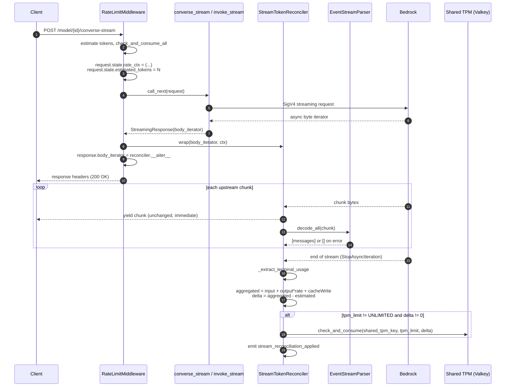

# Rate limiting for streaming responses

Post-stream TPM reconciliation for `/model/{id}/converse-stream` and `/model/{id}/invoke-with-response-stream`.

## Overview

The rate-limit middleware charges TPM in two phases for every Bedrock request:

1. Pre-request: estimate input tokens, atomically consume against the shared TPM counter, forward the request to Bedrock.
2. Post-response: read the actual token usage reported by Bedrock, compute the aggregated total (input + output * burndown + cache-write), and add the delta to the shared TPM counter.

For streaming endpoints, phase 2 runs after the last upstream chunk has been forwarded to the client. A `StreamTokenReconciler` wraps the upstream byte iterator, forwards each chunk to the client before parsing it, extracts the terminal `metadata` (Converse) or `amazon-bedrock-invocationMetrics` (Invoke) event from the AWS EventStream framing, computes the signed delta `aggregated - estimated`, and writes it to the shared TPM counter with a single `INCRBY`-backed `check_and_consume` call.

The reconciler is installed by the middleware, not by the route handlers. Installation happens where `rate_ctx` and the pre-request estimate are already assembled, so no state needs to be threaded through the request pipeline.

## Sequence



## Module layout

| Path | Role |
| --- | --- |
| `backend/app/core/rate_limit/eventstream_parser.py` | Pure decode/encode of AWS EventStream framing. Emits typed `ParseError` with byte offset and `ErrorKind`. Classifies `metadata` and `chunk` messages as Terminal_Usage_Event candidates. |
| `backend/app/core/rate_limit/stream_reconciler.py` | `StreamTokenReconciler`. Wraps the upstream async byte iterator, forwards each chunk before parsing, and applies the signed delta on termination. Also holds the endpoint-keyed extraction dispatch. |
| `backend/app/middleware/rate_limit.py` | `_reconcile_stream` method installs the reconciler on `StreamingResponse` for the two Bedrock streaming endpoints. `_update_tokens` routes by URL path. `dispatch` stores `request.state.estimated_tokens` so the reconciler can compute the delta. |
| `backend/app/observability/rate_limit_metrics.py` | `rate_limit_stream_reconciliation_delta` histogram and `record_stream_reconciliation_delta` helper. |

No routes are modified. The Shared_TPM_Key format `{{{client_id}:{model_id}}}:client:tpm` is unchanged.

## How it works

The reconciler must guarantee three things at once:

1. Client bytes leave the gateway with no added latency and byte-for-byte identical content to what Bedrock produced.
2. The Shared_TPM_Key write happens exactly once, and only after the last upstream byte is forwarded.
3. No exception raised during parsing, extraction, or the Redis write ever surfaces into the client response.

Three async primitives make this possible: Starlette's response lifecycle, Python's async generator protocol, and single-shot exception isolation on every side-effecting call.

### Starlette's role in the timing

`StreamingResponse.body_iterator` is an async iterator that Starlette drives after the middleware `dispatch` method returns. Reassigning `response.body_iterator` to a wrapped iterator inside `dispatch` is a well-supported pattern. Starlette iterates whatever object is assigned there when it renders the response body.

There is a subtlety with `BaseHTTPMiddleware` (the class `RateLimitMiddleware` inherits from) worth understanding, because it shapes what the middleware actually sees. When `call_next` returns, the response object is always a `starlette.responses._StreamingResponse`. This is Starlette's design, not our code: downstream ASGI apps do not return Response objects, they emit `http.response.body` messages into a `send` callable. To hand middleware authors a Response-shaped object, `BaseHTTPMiddleware` reconstructs one from those messages and exposes the body as an async iterator over them. The wrapper looks the same whether the downstream route wrote a hundred streaming chunks or one JSON blob. Only iteration reifies the bytes. This is why the streaming reconciler keys on wrapping `body_iterator` rather than reading a `body` attribute (which the wrapper does not have) and why the non-streaming reconciler in [06](06-rate-limit-synchronous-responses.md) has to drain the iterator before it can parse the JSON.

The install-time work (building `ReconciliationContext`, constructing `StreamTokenReconciler`, replacing `body_iterator`) runs synchronously inside `_reconcile_stream`. The reconciler does not observe a single upstream byte during install. All observation happens later, driven by Starlette's iteration. The response headers, status code, and `body_iterator` type stay untouched from the client's perspective. The only side effect of install is a pointer swap on `response.body_iterator`.

### The yield-before-parse discipline

`StreamTokenReconciler._iterate` is an async generator. On each iteration:

```python
async for chunk in self._upstream:
 # 1. Yield to the client FIRST. The client sees the byte before we touch it.
 yield chunk

 # 2. Only after the yield resumes do we put the chunk in the single-slot buffer.
 self._pending = chunk

 # 3. Parse the chunk with parser exceptions swallowed.
 try:
 messages = self._parser.decode_all(chunk)
 except Exception:
 messages = []

 # 4. Collect Terminal_Usage_Event candidates into a bounded deque.
 for msg in messages:
 if self._is_candidate(msg):
 self._candidates.append(msg)

 # 5. Clear the buffer before the next upstream read.
 self._pending = None
```

Why this ordering matters:

- The `yield chunk` statement suspends the generator and hands the chunk to Starlette, which writes it to the client socket. Only when Starlette pulls the next chunk (calls `__anext__` again) does execution resume past the yield.
- Putting the parse work after the yield means the client sees no added latency from parsing. Even if parsing takes milliseconds, those milliseconds are spent between iterations, not before the client sees the current chunk.
- The single-slot `_pending` buffer is the in-flight record required by the design. It is set after the yield and cleared before the next `async for` step reads from upstream. This satisfies the "at most one chunk pending at a time" invariant that tests can inspect.
- The candidates `deque(maxlen=16)` prevents unbounded memory growth even in the pathological case where the upstream emits many candidate-shaped messages. Well-formed Bedrock streams emit exactly one terminal event.

### Termination paths

The async generator has three ways to end:

Normal exhaustion. The upstream iterator's `__anext__` raises `StopAsyncIteration`, which Python's `async for` catches and turns into loop exit. The `else` clause of the `try / except / else` fires:

```python
else:
 await self._finalize(StreamOutcome.COMPLETED)
```

This is the happy path. `_finalize` extracts terminal usage, computes the delta, applies it to Redis, and emits `stream_reconciliation_applied`.

Client disconnect. When the client closes the connection, Starlette cancels the response task. Python delivers `asyncio.CancelledError` to whichever `await` the generator is currently suspended on, typically the `async for` waiting for the next upstream chunk.

```python
except asyncio.CancelledError:
 await self._finalize(StreamOutcome.CLIENT_DISCONNECT)
 raise
```

The reconciler runs `_finalize` (which emits `stream_reconciliation_skipped` with `reason="client_disconnect"` and touches no counters), then re-raises the cancellation so the surrounding task honours the cancellation contract. Suppressing `CancelledError` would break Starlette's task-cleanup semantics.

Upstream error. Any other exception from the upstream (an `httpx.HTTPStatusError`, a network reset, an aiohttp timeout) propagates into the generator body.

```python
except Exception:
 self._pending = None
 await self._finalize(StreamOutcome.UPSTREAM_ERROR)
 raise
```

Because the iterator yields before buffering, any pending chunk has already reached the client by the time the exception surfaces from `__anext__`. The explicit `_pending = None` is defence-in-depth for a future refactor that reorders the buffer set. `_finalize` runs (emitting `stream_reconciliation_skipped` with `reason="upstream_error"`), then the exception re-raises so upstream error handling still runs.

### Why `_finalize` runs inside the generator

`_finalize` runs from inside the async generator, not after Starlette has finished iterating it. This is deliberate:

- The `async for` loop, the `try / except` guards, and `_finalize` all share the same task context. Emitting a log or awaiting a Redis call from `_finalize` inherits the same `client_id_context`, `client_name_context`, and rate-limit span that the request runs under.
- The generator's cleanup order is guaranteed by the `try / except / else` blocks. There is no window where Starlette could tear down the request state while the reconciler is still awaiting Redis.
- If `_finalize` were scheduled onto a background task, telemetry backends might race with request teardown and lose context. Keeping it in the generator keeps every log line traceable.

### The three isolation layers

`_finalize` performs at most one Redis round-trip, one histogram record, two counter increments, and three log emissions. Every one of them is wrapped so that no failure can escape into the client stream.

Layer 1 (install-time isolation). The entire `_reconcile_stream` body is a `try / except Exception`. If context construction, parser import, or `body_iterator` reassignment raises, the middleware logs `redis_failure_stream_reconciliation` and returns without touching `response.body_iterator`. The client keeps receiving the raw upstream stream.

Layer 2 (chunk-forwarding isolation). Inside the generator body, parser exceptions are caught around `decode_all(chunk)`. The offending chunk is dropped from the candidate pool and iteration continues. The client's byte sequence is byte-for-byte identical to the exception-free run through the last successfully forwarded chunk.

Layer 3 (finalize-time isolation). `_finalize` has three nested guards:

1. A top-level `try / except Exception: pass` that catches everything as defence-in-depth for future refactors.
2. A specific `try / except` around the `check_and_consume` call that records `record_redis_failure("stream_reconciliation", type(e).__name__)`, emits `redis_failure_stream_reconciliation`, and does not re-raise.
3. Every log and metric call routed through a `_safe_emit(fn,...)` helper that swallows any exception the backend raises:

```python
def _safe_emit(fn, *args, **kwargs):
 try:
 fn(*args, **kwargs)
 except Exception:
 pass
```

The swallowed exception is intentionally not re-logged. `logger.error` is itself one of the callables `_safe_emit` guards; re-entering the logger from inside the guard would risk recursively re-triggering the same failure.

### Signed delta semantics

The delta is deliberately not clamped:

```python
aggregated = self._tokens.calculate_aggregated_tokens(
 {"inputTokens": t.input_tokens, "outputTokens": t.output_tokens, "cacheWriteInputTokens": t.cache_write_input_tokens},
 ctx.model_id,
)
delta = aggregated - ctx.estimated_tokens
```

If `estimated > aggregated` (a common case for short streaming responses that finished before the estimated token budget was exhausted), `delta` is negative. `RateLimiter.check_and_consume` wraps Redis `INCRBY`, which accepts negative arguments, and the pre-check `current + tokens > limit` is a no-op for negative tokens. The refund flows back to the shared counter and the client keeps its quota. Clamping to zero would systematically over-charge clients.

### Skip paths

`_finalize` runs an ordered decision tree before it touches Redis:

| Condition | Result | Reason field |
| --- | --- | --- |
| `not ctx.rate_ctx_present` | Skip, no Redis, return in <= 5 ms | `rate_ctx_absent` |
| `ctx.tpm_limit == RATELIMIT_UNLIMITED` | Skip Redis, optionally `record_tokens_consumed` | `tpm_limit_unlimited` |
| `outcome != COMPLETED` | Skip, no Redis | `upstream_error`, `client_disconnect`, `missing_usage`, or `unknown` |
| Terminal usage not extractable | Skip, no Redis | `missing_usage` |
| All above pass | Apply `delta` to Shared_TPM_Key | (emits `stream_reconciliation_applied`) |

Each branch emits a single `stream_reconciliation_skipped` structured log event carrying the reason, so operators can filter dashboards on `event.name = "stream_reconciliation_skipped"` and group by `reason` to understand why reconciliation did or did not run.

## EventStream parsing

Bedrock streaming responses use the [AWS EventStream wire format](https://docs.aws.amazon.com/lexv2/latest/dg/event-stream-encoding.html):

```
+--------------------+ 12-byte prelude
| total_length (u32)|
| headers_length(u32)|
| prelude_crc32 (u32)| over first 8 bytes
+--------------------+
| typed headers | headers_length bytes
+--------------------+
| payload | total_length - headers_length - 16 bytes
+--------------------+
| message_crc32 (u32)| over everything above except itself
+--------------------+
```

`EventStreamParser.decode_all(buf)` decodes the full buffer into a list of `EventStreamMessage(headers=(...), payload=bytes)`. On the first framing error at byte offset `o` it raises `ParseError(kind, offset=o, detail=...)` and returns no partial results.

Two classifiers pick out Terminal_Usage_Event candidates:

- `is_converse_metadata(msg)`. True iff `:event-type` header is STRING `"metadata"` AND payload decodes as a JSON object with a top-level `usage` field.
- `is_invoke_metrics_chunk(msg)`. True iff `:event-type` header is STRING `"chunk"` AND payload decodes as a JSON object with a top-level `amazon-bedrock-invocationMetrics` field.

Both classifiers return `False` (never raise) when the header matches but the payload is malformed UTF-8 or JSON.

The parser is pure and stateless. `encode(msg)` produces bytes whose prelude and message CRC-32 checksums match, so `decode_all(encode(m))` yields a message with identical ordered headers and byte-identical payload. That is the round-trip property the parser tests anchor on.

## Observability

Structured log events emitted by the reconciler:

| `event.name` | When | Required fields |
| --- | --- | --- |
| `stream_reconciliation_applied` | After a successful delta computation and Redis write | `gen_ai.request.model`, `client.id`, `gen_ai.usage.input_tokens`, `gen_ai.usage.output_tokens`, `rate_limit.estimated_tokens`, `rate_limit.aggregated_tokens`, `rate_limit.reconciliation_delta` |
| `stream_reconciliation_skipped` | Any skip path | `gen_ai.request.model`, `client.id`, `reason` |
| `stream_reconciliation_applied_suppressed` | A required applied-event field was null | `gen_ai.request.model`, `client.id`, `missing_fields` |
| `redis_failure_stream_reconciliation` | `check_and_consume` raised, or install failed | `gen_ai.request.model`, `error.message` |

Metrics:

- `rate_limit_stream_reconciliation_delta`. Signed histogram of `aggregated - estimated`, tagged `{client_id, model_id, endpoint}`. Recorded once per successful reconciliation.
- `record_tokens_consumed(client_id, model_id, aggregated, api_type)`. The same counter the non-streaming path writes, called once per successful reconciliation with the aggregated count.
- `record_redis_failure("stream_reconciliation", <ExceptionType>)`. Recorded once per Redis-write failure.

Recommended dashboard queries:

```sql
-- Magnitude of streaming under-accounting per client-model over the last hour
SELECT client_id, model_id, SUM(reconciliation_delta) AS undercharge_tokens
FROM applied_events
WHERE event_time > NOW - INTERVAL '1' HOUR
GROUP BY client_id, model_id
ORDER BY undercharge_tokens DESC;

-- Skip reason distribution
SELECT reason, COUNT(*) FROM skipped_events GROUP BY reason;
```

## Guarantees

Client-facing bytes are unchanged. The reconciler yields upstream chunks in order, byte-for-byte, with no insertion, removal, splitting, or merging. Parser exceptions do not truncate the stream. Redis errors happen after the last byte has already reached the client.

Client latency is unchanged within noise. The per-chunk added delay is bounded by the parse-and-buffer step that runs after `yield`, not before it. Under nominal load this is well under 5 ms per chunk. The `_finalize` step runs after `StopAsyncIteration`, so it does not delay any client byte.

Shared_TPM_Key is written exactly once per stream, after the last upstream chunk is forwarded, and only when all skip conditions fail. The write is a single `INCRBY` with the signed delta.

Reconciliation failures never surface to the client. Three layers of isolation (install-time, chunk-forwarding, finalize-time) ensure any exception is captured, logged as `redis_failure_stream_reconciliation`, and swallowed. The client sees only bytes and 200 OK.

## Not handled

Data loss on gateway crash between last-chunk-forwarded and delta-write leaves that stream's delta un-recorded. Acceptable because TPM windows reset every minute.

Ambiguous multi-metadata streams: a well-formed Bedrock stream emits exactly one metadata or metrics event. If somehow the upstream emits several, the reconciler uses the last one.

Backpressure past a single chunk: the single-slot buffer means the reconciler naturally applies backpressure to the upstream when the client is slow, without any additional queueing.

## Related documents

- [Rate limiting for synchronous responses](06-rate-limit-synchronous-responses.md). The same reconciliation model for non-streaming Bedrock endpoints.
- [Request Flow](02-request-flow.md). Where this feature slots into the request lifecycle.
- [Operations](04-operations.md). Dashboards and monitoring.
- [Rate Limiting setup](../01-setup/04-rate-limiting.md). Configuration surface.

## Appendix: implementation walkthrough

The appendix walks a fresh branch through the exact edits in the order that keeps intermediate states test-passing.

### Step 1: add Hypothesis to dev dependencies

Add `hypothesis` to `[dependency-groups.dev]` in the workspace-root `pyproject.toml`, then `uv sync`. Property-based tests for the aggregation math, the parser round-trip, and the streaming pipeline depend on it.

### Step 2: add the observability histogram

File: `backend/app/observability/rate_limit_metrics.py`.

```python
stream_reconciliation_delta = meter.create_histogram(
 name="rate_limit_stream_reconciliation_delta",
 description=(
 "Signed delta (aggregated - estimated) applied to Shared_TPM_Key after a streaming response"
 ),
 unit="tokens",
)

def record_stream_reconciliation_delta(
 client_id: str, model_id: str, endpoint: str, delta: int
) -> None:
 stream_reconciliation_delta.record(
 delta,
 {"client_id": client_id, "model_id": model_id, "endpoint": endpoint},
 )
```

### Step 3: build the EventStream parser

File: `backend/app/core/rate_limit/eventstream_parser.py` (new).

Data model at the top of the file:

```python
class HeaderType(IntEnum):
 BOOL_TRUE = 0
 BOOL_FALSE = 1
 BYTE = 2
 SHORT = 3
 INTEGER = 4
 LONG = 5
 BYTE_ARRAY = 6
 STRING = 7
 TIMESTAMP = 8
 UUID = 9

@dataclass(frozen=True)
class Header:
 name: str
 wire_type: HeaderType
 value: bool | int | bytes | str | datetime | UUID

@dataclass(frozen=True)
class EventStreamMessage:
 headers: tuple[Header,...]
 payload: bytes

class ErrorKind(str, Enum):
 EMPTY = "empty"
 TRUNCATED = "truncated"
 LENGTH_OVERRUN = "length-overrun"
 FRAMING_INVALID = "framing-invalid"

@dataclass(frozen=True)
class ParseError(Exception):
 kind: ErrorKind
 offset: int
 detail: str
```

Then `EventStreamParser` with `decode_all`, `encode`, `encode_many`, and the two classifiers. Framing rules:

1. Read 12-byte prelude, verify CRC-32 over first 8 bytes.
2. Read headers block, decode each 1-byte name-length + ASCII name + 1-byte wire type + typed value.
3. Slice payload of length `total_length - headers_length - 16`.
4. Verify trailing message CRC-32 over everything above except itself.
5. Reject buffers longer than 16,777,216 bytes with `LENGTH_OVERRUN`.
6. On the first framing error, raise `ParseError` with byte offset and kind. Do not return partial results.

The two classifiers key on `:event-type` and attempt a UTF-8 JSON decode of the payload. Non-JSON payloads return `False`, never raise.

### Step 4: reconciler data models

File: `backend/app/core/rate_limit/stream_reconciler.py` (new).

```python
class StreamOutcome(str, Enum):
 COMPLETED = "completed"
 UPSTREAM_ERROR = "upstream_error"
 CLIENT_DISCONNECT = "client_disconnect"
 MISSING_USAGE = "missing_usage"
 UNKNOWN = "unknown"

@dataclass(frozen=True)
class TerminalUsage:
 input_tokens: int
 output_tokens: int
 cache_write_input_tokens: int
 # __post_init__ clamps each field to [0, 2**31 - 1].

@dataclass(frozen=True)
class ReconciliationContext:
 client_id: str
 model_id: str
 account_id: str
 tpm_limit: int
 api_type: str
 endpoint: str
 estimated_tokens: int
 rate_ctx_present: bool
```

### Step 5: terminal-usage extraction dispatch

Same file. Dispatch on `ctx.endpoint`; return `None` on any failure so the caller maps it to `MISSING_USAGE`.

```python
class StreamTokenReconciler:
 def _extract_terminal_usage(self, messages):
 if self._ctx.endpoint == _CONVERSE_STREAM_ENDPOINT:
 return self._extract_converse_terminal(messages)
 if self._ctx.endpoint == _INVOKE_STREAM_ENDPOINT:
 return self._extract_invoke_terminal(messages)
 return None
```

Both `_extract_converse_terminal` and `_extract_invoke_terminal` pick the last matching candidate, JSON-decode the payload, and read the endpoint-specific field names with zero substituted for absent fields. See the source for the exact keys.

### Step 6: async iterator with yield-before-parse

Same file. `__aiter__` returns a fresh async generator. The generator body is the sole owner of `_pending` and `_candidates`.

See the code snippet in [The yield-before-parse discipline](#the-yield-before-parse-discipline) above.

### Step 7: `_finalize` with skip paths, delta computation, telemetry

Same file. The ordered decision tree from [Skip paths](#skip-paths) is the whole method. The outer `try / except Exception: pass` is defence-in-depth; the specific `try / except` around the `check_and_consume` call is the primary Redis-failure guard.

### Step 8: `_safe_emit` and the emit helpers

Same file. `_safe_emit` is the single seam through which every log and metric call runs. See the snippet in [The three isolation layers](#the-three-isolation-layers).

### Step 9: wire the reconciler into the middleware

File: `backend/app/middleware/rate_limit.py`.

Import the reconciler types and constants:

```python
from core.rate_limit.stream_reconciler import (
 ReconciliationContext,
 StreamTokenReconciler,
)
```

Add a module-level endpoint detector:

```python
def _detect_stream_endpoint(path: str) -> str | None:
 if path.endswith("/converse-stream"):
 return "converse-stream"
 if path.endswith("/invoke-with-response-stream"):
 return "invoke-with-response-stream"
 return None
```

Store the pre-request estimate in `dispatch` after computing `estimated_tokens`:

```python
request.state.estimated_tokens = estimated_tokens
```

Route by URL in `_update_tokens`:

```python
async def _update_tokens(self, request, response):
 try:
 endpoint = _detect_stream_endpoint(request.url.path)
 if endpoint is not None:
 await self._reconcile_stream(request, response)
 return
 await self._reconcile_non_stream(request, response)
 except Exception as e:
 #... isolation guard...
```

Install the reconciler in `_reconcile_stream`:

```python
async def _reconcile_stream(self, request: Request, response: StreamingResponse) -> None:
 try:
 rate_ctx = getattr(request.state, "rate_ctx", None)
 rate_ctx_present = rate_ctx is not None
 endpoint = _detect_stream_endpoint(request.url.path)
 if endpoint is None:
 return
 estimated = getattr(request.state, "estimated_tokens", 0)
 if rate_ctx_present:
 client_id, model_id, account_id, tpm_limit, api_type = rate_ctx
 else:
 client_id = model_id = account_id = api_type = ""
 tpm_limit = RATELIMIT_UNLIMITED
 ctx = ReconciliationContext(
 client_id=client_id,
 model_id=model_id,
 account_id=account_id,
 tpm_limit=tpm_limit,
 api_type=api_type,
 endpoint=endpoint,
 estimated_tokens=estimated,
 rate_ctx_present=rate_ctx_present,
 )
 reconciler = StreamTokenReconciler(
 upstream=response.body_iterator,
 ctx=ctx,
 tokens=self.tokens,
 limiter=self.rate_limiter.limiter,
 )
 response.body_iterator = reconciler.__aiter__
 except Exception as e:
 #... install-time isolation...
```

### Step 10: verify

Run the full unit suite from the workspace root:

```bash
uv run pytest -c test/unit/pytest.ini --no-cov -q
```

Confirm the reconciler modules import cleanly:

```bash
uv run python -c "
from core.rate_limit.stream_reconciler import StreamTokenReconciler, ReconciliationContext, StreamOutcome
from core.rate_limit.eventstream_parser import EventStreamParser
from middleware.rate_limit import RateLimitMiddleware
print('OK')
"
```

### Step 11 (optional): property and example tests

Recommended additions under `test/unit/`:

- `core/rate_limit/test_tokens.py`. Properties for `calculate_aggregated_tokens` (>= `max(1, inputTokens)` invariant) and the `estimated + delta == aggregated` identity.
- `core/rate_limit/test_eventstream_parser.py`. Round-trip property over 200+ generated message lists; one example per `ErrorKind`; non-JSON payload -> classifier returns `False`.
- `core/rate_limit/test_stream_reconciler.py`. Streaming pipeline fidelity property (`Y == U` byte-for-byte, buffer <= 1 chunk at every step); one example per `StreamOutcome`; exception isolation at each layer; skip-reason emission per branch; log/metric shape.
- `middleware/test_rate_limit.py`. Integration test that mounts a mock upstream ending in a Converse `metadata` event, asserts `check_and_consume` is called exactly once with `aggregated - estimated`, and the forwarded byte sequence matches the mock upstream.

### Traceability

| Requirement | Implemented in | Verified by |
| --- | --- | --- |
| 1.1-1.7 (Converse reconciliation) | Steps 4, 5, 7 | Step 11: `test_stream_reconciler.py` |
| 2.1-2.6 (Invoke reconciliation) | Steps 4, 5, 7 | Step 11: `test_stream_reconciler.py` |
| 3.1-3.7 (EventStream parser) | Step 3 | Step 11: `test_eventstream_parser.py` |
| 4.1-4.7 (Streaming latency + bytes) | Step 6 | Step 11: property test in `test_stream_reconciler.py` |
| 5.1-5.5 (No terminal usage) | Step 7 | Step 11: skip-reason tests |
| 6.1-6.4 (Failure isolation) | Steps 6, 7, 8, 9 | Step 11: exception isolation tests |
| 7.1-7.5 (Skip when not applicable) | Step 7 | Step 11: skip-reason tests |
| 8.1-8.4 (Observability signals) | Steps 2, 7, 8 | Step 11: log/metric shape tests |
| 9.1-9.6 (Test coverage) | Step 11 | The tests themselves |
