# Architecture

System design and implementation details.

The gateway implements a multi-account, containerized architecture that provides secure, scalable access to Amazon Bedrock.

## High-level architecture

```mermaid
graph TB
    subgraph "Client Layer"
        Client[Client Applications]
    end

    subgraph "Central Account"
        ALB[Application Load Balancer]
        ECS[ECS Fargate Tasks]
        Valkey[(Valkey Cache)]
    end

    subgraph "Shared Accounts"
        BR1[Bedrock Account 1]
        BR2[Bedrock Account 2]
        BRN[Bedrock Account N]
    end

    OAuth[OAuth Provider]

    Client -->|HTTPS + JWT| ALB
    ALB --> ECS
    ECS <--> Valkey
    ECS -->|AssumeRole| BR1
    ECS -->|AssumeRole| BR2
    ECS -->|AssumeRole| BRN
    OAuth -.->|JWKS| ECS

    style ALB fill:#ff9900
    style ECS fill:#ff9900
    style Valkey fill:#ff9900
    style BR1 fill:#232f3e
    style BR2 fill:#232f3e
    style BRN fill:#232f3e
```

## Key components

**Application Load Balancer** - Handles TLS termination, health checks, and request routing

**ECS Fargate** - Runs the gateway application in containers with auto-scaling

**Valkey** - Stores rate limiting state and credential cache

**OAuth Provider** - Validates JWT tokens via JWKS endpoint

**Shared Accounts** - Provide access to Amazon Bedrock models

## Request flow

1. Client requests OAuth token from provider
2. Client sends request to ALB with JWT token
3. Gateway validates JWT signature and claims
4. Gateway checks rate limits in Valkey
5. Gateway selects AWS account with available capacity
6. Gateway assumes IAM role in selected account
7. Gateway invokes Amazon Bedrock
8. Gateway returns response to client

## Design principles

**Stateless** - Gateway containers are stateless for horizontal scaling

**Multi-tenant** - Single gateway serves multiple clients with isolation

**Transparent proxy** - Request/response formats match Bedrock API exactly

**Credential caching** - STS credentials cached for sub-10ms latency

**Automatic failover** - Requests route to healthy accounts automatically

## Documentation

- [Overview](01-overview.md) - Components, design decisions, and security
- [Request Flow](02-request-flow.md) - How requests are processed
- [Networking](03-networking.md) - VPC and network architecture
- [Operations](04-operations.md) - Monitoring, scaling, and maintenance
- [Development](05-development.md) - Local development and contributing
